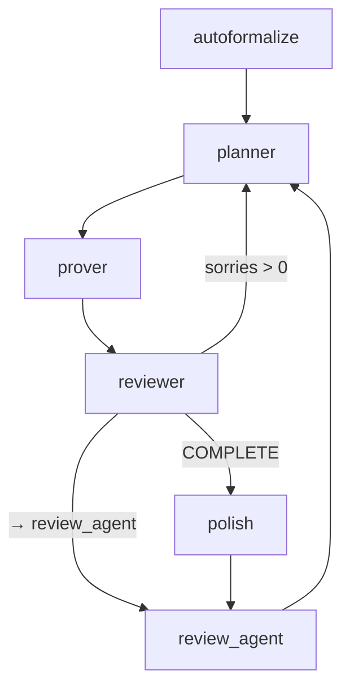
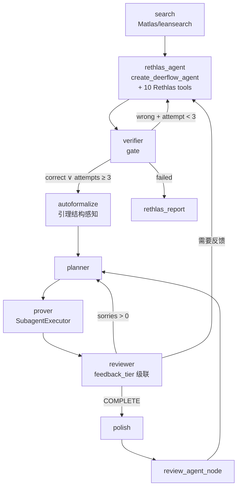

# Archon on DeerFlow — 数学定理证明系统 🏛️🦞

**Rethlas (自适应证明探索) + Archon (Lean4 形式化证明填充)** 的统一数学定理自动证明系统，
构建于 DeerFlow (LangGraph + MCP + Sandbox + Subagent) 之上。

> 最后更新: 2026-05-20 · 移植度: Archon 67% / Rethlas 60% · 完整评估见 [AUDIT_V4.md](AUDIT_V4.md)

---

## 两个工作流

### 1. `archon_workflow` — Lean4 证明填充

已有 Lean 项目时使用，自动扫描 `sorry` → 填充 → `lake build` 验证。



```
节点: autoformalize → planner → prover → reviewer → review_agent → (loop)
特性: 并行 SubagentExecutor (每文件), 22 LSP tools, 自动化策略级联 (7/10)
```

### 2. `unified_prover` — 完整数学定理证明

从自然语言命题到 Lean4 形式化证明的全自动闭环。



```
Rethlas 侧: search → rethlas_agent (自适应 agent loop, 10 tools) → verifier (gate) → (loop ≤3)
Archon 侧: autoformalize → planner → prover → reviewer → polish → review_agent
```

---

## 仓库结构

```
archon-deerflow/
├── overlay/
│   ├── backend/
│   │   ├── langgraph.json              ← 图注册 (archon_workflow, unified_prover)
│   │   └── workflows/
│   │       ├── __init__.py             ← 导出 run_archon_workflow / run_unified_workflow
│   │       ├── archon_graph.py         ← Archon: 6 节点 Lean4 证明 (StateGraph)
│   │       ├── unified_graph.py        ← Unified: 10 节点完整闭环 (StateGraph)
│   │       ├── shared.py               ← 共享 I/O: sandbox, tactics, error parse, memory
│   │       └── skill_tools.py          ← 10 个 LangChain tool (原版 Rethlas skills)
│   ├── extensions_config.json          ← lean-lsp MCP server 配置
│   └── skills/custom/
│       ├── archon-lean4/               ← Archon Lean4 知识: 42 references, 10 commands, 4 agents, 17 scripts
│       └── math-prover/                ← Rethlas 移植: SKILL.md, generator.md, verifier.md, 10 sub-skills
├── tests/fixtures/sample.lean          ← 测试用 Lean 文件
├── paper_diagrams/                     ← 工作流 Mermaid 图 (10 张)
├── docker/                             ← Docker 部署 (Dockerfile, compose, nginx, entrypoint)
├── AUDIT_V4.md                         ← 最新移植度评估
├── MIGRATION_LOG.md                    ← 改动记录
├── TODO.md                             ← 待办事项
└── README.md                           ← 本文件
```

---

## 核心组件

### `skill_tools.py` — 10 个 Rethlas 自适应 Skill (LangChain Tools)

对应原版 Rethlas 的 10 个自适应推理技能，全部 `bind_tools()` 到 model：

| # | Tool | 原版 Skill | 功能 |
|:-:|------|-----------|------|
| 1 | `obtain_immediate_conclusions` | obtain-immediate-conclusions | 直接推理/廉价推进 |
| 2 | `search_mathematical_results` | search-math-results | Matlas 定理搜索 (8M statements) |
| 3 | `query_memory` | query-memory | 搜索 10-channel JSONL memory |
| 4 | `construct_examples` | construct-toy-examples | 构造具体例子 |
| 5 | `construct_counterexamples` | construct-counterexamples | 构造反例，发现障碍点 |
| 6 | `propose_decomposition` | propose-subgoal-decomposition-plans | 多方向分解方案 |
| 7 | `direct_proving` | direct-proving | 筛选一个方案，找出卡点 |
| 8 | **`recursive_proving`** | **recursive-proving** | **Plan A/B/C 并行探索** |
| 9 | `identify_key_failures` | identify-key-failures | 总结共同失败模式 |
| 10 | `verify_proof` | verify-proof | 严格验证(verdict + repair_hints) |

### `shared.py` — 共享基础设施

| 模块 | 功能 |
|------|------|
| `sandbox_context()` | DeerFlow Sandbox 生命周期管理 (acquire/release) |
| `exec_with_sandbox()` / `read_with_sandbox()` / `write_with_sandbox()` | 沙箱感知 I/O |
| `scan_sorries()` / `count_sorries()` / `build_project()` / `verify_file()` | Lean 项目操作 |
| `parse_lean_errors()` / `classify_error()` | 结构化错误解析 (10 种) |
| `classify_failure()` | 5 种失败模式识别 |
| `try_tactics_cascade()` / `AUTO_TACTICS` | 7 种自动化策略级联 |
| `get_checkpointer()` | SqliteSaver/MemorySaver 自动检测 |
| **`init_rethlas_memory()`** / **`append_rethlas_memory()`** / **`search_rethlas_memory()`** | **R8: 10-channel JSONL memory** |
| `search_matlas()` | Matlas 定理搜索引擎 |

### R8: 10-channel JSONL Memory

对应原版 Rethlas MCP memory，持久化到 `.archon-journal/rethlas_memory/{problem_id}/`：

```
rethlas_memory/{problem_id}/
├── meta.json
├── immediate_conclusions.jsonl    ← 直接结论
├── toy_examples.jsonl             ← 例子
├── counterexamples.jsonl          ← 反例
├── subgoals.jsonl                 ← 分解方案
├── proof_steps.jsonl              ← 证明步骤
├── failed_paths.jsonl             ← 失败路径
├── verification_reports.jsonl     ← 验证报告
├── recursive_results.jsonl        ← 并行探索结果
├── search_results.jsonl           ← 搜索结果
└── failures.jsonl                 ← 失败分析
```

### `rethlas_agent_node` — 自适应 Agent (核心改造)

使用 `create_deerflow_agent(model, tools=ALL_10_TOOLS)` 替代原固定 pipeline。
Agent 自评估状态 → 自主选择 skill → 执行 → 持久化 → 重复。
`verify_proof_tool` 内部做严格验证，`recursive_proving_tool` 内部 spawn 并行子 agent。

### `autoformalize_node` — 增强版 (2026-05-20)

原版 Archon 的三阶段之首的变化：
1. LLM 分析非形式化证明 → 提取引理依赖图
2. 按依赖顺序生成 Lean 声明骨架，每引理 `sorry` 占位
3. 大证明按 `/- MODULE: name -/` 拆分多个 `.lean` 文件
4. 自动生成 `lakefile.toml`

---

## DeerFlow 基础设施接入

| 模块 | 接入状态 | 用途 |
|------|:------:|------|
| `deerflow.models` (`create_chat_model`) | ✅ | LLM 调用 |
| `deerflow.tools` (`get_available_tools`) | ✅ | MCP 工具聚合 (22 LSP tools) |
| `deerflow.mcp` (`get_cached_mcp_tools`) | ✅ | Lean LSP 工具加载 |
| `deerflow.sandbox` | ✅ | `sandbox_context()` acquire/release |
| `deerflow.subagents` (`SubagentExecutor`) | ✅ | 并行文件级证明 |
| `deerflow.agents.factory` (`create_deerflow_agent`) | ✅ | Rethlas 自适应 agent |
| `deerflow.agents.features` (`RuntimeFeatures`) | ✅ | Agent 中间件链 |
| `deerflow.runtime.events` (`JsonlRunEventStore`) | ✅ | 框架级运行日志 |
| `deerflow.agents.middlewares.token_usage` | ✅ | LLM 成本追踪 |
| `langgraph.checkpoint` (`SqliteSaver`) | ✅ | 状态持久化 (自动恢复) |

**中断处理：** 当图通过 DeerFlow Gateway 运行时，中断由 `worker.py:run_agent()` 的 `abort_event` 机制自动处理。支持 `interrupt` (保留 checkpoint) 和 `rollback` (恢复到 run 前状态) 两种模式。

---

## 运行模式

### Python API

```python
# Lean4 证明填充
from deerflow.archon_workflow import run_archon_workflow
result = run_archon_workflow(
    "/path/to/lean-project",
    max_loops=5,          # 最大循环次数
    parallel=True,        # True=并行prover, False=串行
    dry_run=False,        # True=只打印prompt不调LLM
)

# 完整数学证明
from deerflow.archon_workflow import run_unified_workflow
result = run_unified_workflow(
    statement="证明: √2 是无理数",
    workspace_path="/path/to/project",
    max_loops=5,
    parallel=True,
    dry_run=False,
)
```

### REST API (DeerFlow 运行时)

```bash
curl -X POST http://localhost:2026/runs \
  -H "Content-Type: application/json" \
  -d '{
    "assistant_id": "unified_prover",
    "input": {
      "statement": "证明: 素数有无穷多个",
      "workspace_path": "/projects/unified-proof"
    }
  }'
```

---

## 快速开始

```bash
# 1. 部署 DeerFlow + Archon
git clone https://github.com/Titanium-dioxides/archon-deerflow.git
cd archon-deerflow
cp .env.example .env  # 填入 DEEPSEEK_API_KEY
./bootstrap.sh

# 2. 创建 Lean 项目
mkdir my-project && cd my-project && mkdir MyProject
cat > MyProject/Basic.lean << 'EOF'
theorem my_theorem (n : Nat) : n + 0 = n := by
  sorry
EOF
cat > lakefile.toml << 'EOF'
name = "my-project"
[[lean_lib]]
name = "MyProject"
EOF
echo "leanprover/lean4:v4.29.1" > lean-toolchain

# 3. 运行证明
curl -X POST http://localhost:2026/runs \
  -H "Content-Type: application/json" \
  -d '{"assistant_id":"archon_workflow","input":{"workspace_path":"/projects/my-project"}}'
```

---

## 关键文档

| 文件 | 内容 |
|------|------|
| [AUDIT_V4.md](AUDIT_V4.md) | 最新移植完成度评估 (Archon 67%, Rethlas 60%) |
| [MIGRATION_LOG.md](MIGRATION_LOG.md) | 所有改动的详细记录 |
| [TODO.md](TODO.md) | 待办事项和已知问题 |
| [BLOCKERS.md](BLOCKERS.md) | 受阻问题和依赖分析 |
| [paper_diagrams/](paper_diagrams/) | 10 张工作流 Mermaid 图 |
| [DEERFLOW_REFERENCE.md](DEERFLOW_REFERENCE.md) | DeerFlow 规范实践参考 |
