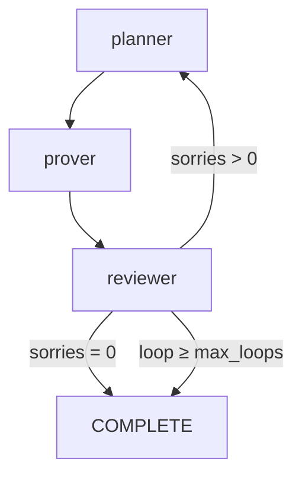
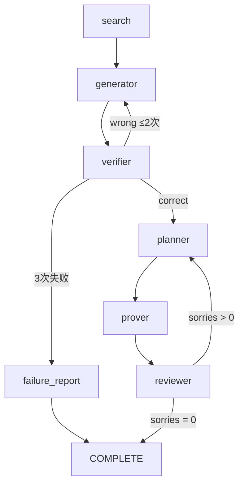

# Archon-DeerFlow 完整使用手册

> 数学定理自动证明系统 · v2.0

---

## 目录

1. [Docker 部署](#1-docker-部署)
2. [创建数学命题](#2-创建数学命题)
3. [运行自动证明](#3-运行自动证明)
4. [工作流监控](#4-工作流监控)
5. [系统架构调整](#5-系统架构调整)
6. [排错指南](#6-排错指南)
7. [参考](#7-参考)

---

## 1. Docker 部署

### 1.1 前置条件

```
OS:       Linux / macOS / WSL2
已安装:   Docker ≥ 24, Git, Make
Lean:     (可选，容器自动安装)
```

### 1.2 获取代码

```bash
git clone https://github.com/Titanium-dioxides/archon-deerflow.git
cd archon-deerflow
```

仓库只包含 **overlay**（定制层），不包含 DeerFlow 本体。部署脚本会自动获取。

### 1.3 配置 API Key

```bash
cp .env.example .env
```

编辑 `.env`，填入至少一个 LLM API key：

```bash
# DeepSeek（推荐，已预配为默认模型）
DEEPSEEK_API_KEY=sk-xxxxxxxxxxxxxxxxxxxxxxxxxxxxxxxx

# 或 OpenAI 兼容
OPENAI_API_KEY=sk-xxxxxxxxxxxxxxxxxxxxxxxxxxxxxxxx
```

### 1.4 一键部署

```bash
./scripts/bootstrap.sh
```

脚本自动完成：

```
1. 检查 Docker + Git
2. git clone DeerFlow
3. 复制 overlay/config/skills
4. Docker compose build
5. 容器内安装 Lean 4.29.1
6. 启动全部服务
```

### 1.5 验证部署

```bash
# 检查容器状态
docker ps --format "table {{.Names}}\t{{.Status}}\t{{.Ports}}"

# 应看到:
# deer-flow-gateway    Up    8001/tcp
# deer-flow-frontend   Up    3000/tcp
# deer-flow-nginx      Up    0.0.0.0:2026->2026/tcp

# 检查健康状态
curl http://localhost:2026/health
# → {"status":"healthy","service":"deer-flow-gateway"}

# 检查 Lean 是否安装
docker exec deer-flow-gateway lean --version
# → Lean (version 4.29.1, ...)
```

### 1.6 常用命令

```bash
make docker-logs              # 查看所有日志
make docker-logs --gateway    # 只看后端日志
make docker-stop              # 停止服务
make docker-start             # 启动服务（不停机重建）
```

---

## 2. 创建数学命题

### 2.1 场景 A：已有 Lean 项目（填充 `sorry`）

适用于：你有一个 Lean 项目，其中某些定理有 `sorry` 占位符。

```bash
# 创建 Lean 项目
mkdir my-lean-theorem && cd my-lean-theorem
mkdir MyTheorem

# 写入带 sorry 的定理
cat > MyTheorem/Basic.lean << 'EOF'
import Mathlib

open Real

/-- 证明: √2 是无理数。 -/
theorem sqrt_two_irrational : √2 ∉ ℚ := by
  sorry
EOF

# 创建项目配置
cat > lakefile.toml << 'EOF'
name = "my-theorem"
[[lean_lib]]
name = "MyTheorem"
EOF
echo "leanprover/lean4:v4.29.1" > lean-toolchain

# 验证项目结构
lake build  # 会有 sorry 警告，正常
```

### 2.2 场景 B：从自然语言命题开始（完整闭环）

适用于：你有一个数学命题，希望系统自动生成非形式化证明然后形式化为 Lean。

```bash
mkdir unified-proof && cd unified-proof
mkdir Proof

# 先创建空的 Lean 文件（系统会自动填充）
cat > Proof/Statement.lean << 'EOF'
/-- 用户命题 -/
theorem my_theorem : True := by
  sorry
EOF

# 创建项目配置
cat > lakefile.toml << 'EOF'
name = "proof"
[[lean_lib]]
name = "Proof"
EOF
echo "leanprover/lean4:v4.29.1" > lean-toolchain
```

### 2.3 命题编写规范

**好的命题** — 最可能被证明：

```lean
/-- 结构清晰的定理声明 -/
theorem add_comm (a b : ℕ) : a + b = b + a := by
  sorry

/-- 带有类型约束的定理 -/
theorem pos_sum_pos (a b : ℕ) (ha : a > 0) (hb : b > 0) : a + b > 0 := by
  sorry
```

**避免的命题** — 超出本地 Lean 能力的：

```lean
-- ❌ 需要高级分析/数论: "所有偶数都能表示为两个素数之和"
-- ❌ 需要代数几何: "任意光滑复射影簇的Hodge分解成立"
-- ❌ 开放问题: "P ≠ NP"
```

### 2.4 使用 Rethlas 非形式化验证（可选）

即使没有 Lean 项目，你也可以单独使用 Rethlas 的生成→验证闭环来检查一个命题的合理性：

```python
from deerflow.archon_workflow.unified_graph import (
    build_unified_graph, fresh_state,
    search_node, generator_node, verifier_node, failure_report_node,
)

state = fresh_state("证明: 素数有无穷多个")
state = search_node(state)
for _ in range(3):
    state = generator_node(state)
    state = verifier_node(state)
    if state["rethlas_history"][-1]["verdict"]["verdict"] == "correct":
        print("✅ 证明通过")
        break
```

---

## 3. 运行自动证明

### 3.1 方式 A：Python API（最直接）

```bash
cd /path/to/deer-flow/backend
```

**工作流 1：Lean4 证明**（已有 `sorry` 的项目）

```python
from deerflow.archon_workflow import run_archon_workflow

result = run_archon_workflow("/projects/my-lean-theorem")
print(result["stage"])        # COMPLETE（全部证明完成）
print(result["completed"])    # 已证明的文件列表
print(result["loop_count"])   # 循环次数
```

**工作流 2：统一证明**（从命题到 Lean）

```python
from deerflow.archon_workflow import run_unified_workflow

result = run_unified_workflow(
    statement="证明: √2 是无理数",
    workspace_path="/projects/unified-proof",
)
print(result["stage"])              # COMPLETE
print(result["rethlas_attempts"])   # Rethlas 尝试次数
print(result["completed"])          # 已证明的文件
```

### 3.2 方式 B：API 调用（远程触发）

当 DeerFlow 以 Docker 运行时：

```bash
# 触发 archon_workflow
curl -X POST http://localhost:2026/runs \
  -H "Content-Type: application/json" \
  -d '{
    "assistant_id": "archon_workflow",
    "input": {
      "workspace_path": "/projects/my-lean-theorem"
    },
    "config": {
      "configurable": {"thread_id": "test-run-1"}
    }
  }'

# 触发 unified_prover
curl -X POST http://localhost:2026/runs \
  -H "Content-Type: application/json" \
  -d '{
    "assistant_id": "unified_prover",
    "input": {
      "statement": "证明: 素数有无穷多个",
      "workspace_path": "/projects/unified-proof"
    },
    "config": {
      "configurable": {"thread_id": "unified-1"}
    }
  }'
```

### 3.3 方式 C：DeerFlow Web UI

1. 打开 http://localhost:2026
2. 在对话窗口输入：
   ```
   请分析 /projects/my-project 并证明所有 sorry。
   ```
3. DeerFlow 的 `lead_agent` 会自动判断是否应触发 `archon_workflow`
4. 也可以在 UI 中直接调用工具运行工作流

### 3.4 方式 D：容器内直接执行

```bash
docker exec deer-flow-gateway sh -c '
  cd /app/backend && PYTHONPATH=. uv run python3 -c "
from pathlib import Path
from deerflow.archon_workflow import run_archon_workflow

result = run_archon_workflow(\"/projects/my-project\")
print(\"Stage:\", result[\"stage\"])
print(\"Completed:\", result[\"completed\"])
"'
```

### 3.5 参数说明

| 参数 | 默认值 | 说明 |
|------|--------|------|
| `workspace_path` | — | Lean 项目根目录（必须含 lakefile） |
| `max_loops` | 3 | 最大循环次数（防死循环） |
| `statement` | — | 数学命题（仅 unified_prover） |

---

## 4. 工作流监控

### 4.1 运行时日志

```bash
# 实时追踪后端日志
docker logs deer-flow-gateway -f | grep "\[plan\]\|\[prove\]\|\[review\]\|\[rethlas\]\|\[search\]"

# 输出示例:
# [plan] loop #1, scanning /projects/simple-test
# [plan] 1 sorries
# [prove] ./Test/Basic.lean
# [prove] ✅ ./Test/Basic.lean
# [review] Build: PASS, sorries: 0, done: 1
```

### 4.2 查看运行结果

```python
result = run_archon_workflow("/path")

# 当前阶段
result["stage"]          # "COMPLETE" | "PROVER" | "AUTOFORMALIZE"

# 完成状态
result["completed"]      # ["path/to/file.lean", ...]
result["pending"]        # [{"file":"...", "line":"...", ...}]

# 循环信息
result["loop_count"]     # 实际循环次数
result["max_loops"]      # 配置的最大循环次数

# 审查摘要
result["review"]         # "Build: PASS, sorries: 0, done: 1"

# Rethlas 信息（仅 unified_prover）
result["rethlas_attempts"]  # 非形式化证明尝试次数
result["rethlas_failed"]    # 是否失败
result["informal_proof"]    # 生成的非形式化证明
```

### 4.3 检查 Lean 编译结果

```bash
# 容器内直接编译
docker exec deer-flow-gateway sh -c 'cd /projects/my-project && lake build'

# 查看 sorries 数量
docker exec deer-flow-gateway sh -c '
  cd /projects/my-project
  grep -rn "sorry" --include="*.lean" . | grep -v ".lake/" | wc -l
'
```

### 4.4 LangGraph Studio 可视化

如果部署了 LangGraph Server（DeerFlow 内置），可以在浏览器中打开 LangGraph Studio 查看完整的图执行过程：

```
http://localhost:2026/_langgraph/studio
```

每个节点（planner / prover / reviewer）的输入输出都可以展开查看：

```
━━ planner ━━
Input:  {"workspace_path": "/projects/...", "stage": "AUTOFORMALIZE"}
Output: {"stage": "PROVER", "pending": [...], "loop_count": 1}

━━ prover ━━
Input:  {"pending": [{"file": "./Test/Basic.lean", ...}]}
Output: {"completed": ["./Test/Basic.lean"], "pending": []}

━━ reviewer ━━
Input:  {"stage": "PROVER"}
Output: {"stage": "COMPLETE", "review": "Build: PASS, ..."}
```

### 4.5 自定义监控钩子

在 `archon_graph.py` 中，每个节点函数都是纯 Python，可以插入任意监控代码：

```python
def prover_node(state):
    # ... existing code ...

    # 自定义监控：记录每个定理的证明时间
    import time
    start = time.time()
    # ... 证明代码 ...
    elapsed = time.time() - start

    # 写入监控日志
    with open("/var/log/archon_proofs.csv", "a") as f:
        f.write(f"{file},{elapsed:.2f},{'PASS' if ok else 'FAIL'}\n")

    return state
```

---

## 5. 系统架构调整

### 5.1 切换模型

编辑 `/path/to/deer-flow/config.yaml` 中的 `models` 段：

```yaml
models:
  - name: deepseek-v4          # ← archon_graph.py 中引用此名称
    use: langchain_openai:ChatOpenAI
    model: deepseek-v4-flash
    base_url: https://api.deepseek.com
    api_key: ${DEEPSEEK_API_KEY}

  # 追加新模型：
  - name: gpt-5
    use: langchain_openai:ChatOpenAI
    model: gpt-5.4
    api_key: ${OPENAI_API_KEY}
    base_url: https://api.openai.com/v1
```

然后在 `archon_graph.py` 中将 `_model()` 的默认参数改为新模型名。

### 5.2 调整节点行为

编辑 `overlay/backend/workflows/archon_graph.py`：

```python
# 修改重试次数
MAX_RETRIES = 5  # 默认 3

# 修改循环上限
state["max_loops"] = 10  # 默认 3

# 启用/禁用推理模型 fallback
def prover_node(state):
    # ...
    # 注释掉推理模型回退：
    # hint = _model(think=True).invoke(...)
    # ...
```

### 5.3 自定义 Rethlas 提示词

编辑 `skills/custom/math-prover/prompts/` 下的文件：

```
generator.md     ← 修改证明生成器的行为、风格、约束
verifier.md      ← 修改验证器的严格程度、输出格式
```

### 5.4 添加新工具

在节点函数中，可以自由使用任何 Python 库或 Shell 命令：

```python
def prover_node(state):
    # 调用外部 SAT 求解器
    import subprocess
    r = subprocess.run(["z3", "-in"], input=smt2_input, capture_output=True, text=True)
    
    # 调用 MCP 工具
    # (需要通过 DeerFlow 的 MCP 系统注册)
    
    return state
```

### 5.5 部署自定义图

如果你想添加自己的工作流：

```python
# 1. 在 overlay/backend/workflows/ 下创建文件
# 2. 在 __init__.py 中导出
# 3. 在 langgraph.json 中注册

{
  "graphs": {
    "my_graph": "deerflow.archon_workflow:build_my_graph"
  }
}
```

### 5.6 调整 Lean 版本

Docker 容器默认安装 Lean 4.29.1。如需切换：

```bash
docker exec deer-flow-gateway sh -c '
  export PATH="$HOME/.elan/bin:$PATH"
  elan toolchain install leanprover/lean4:v4.30.0
  elan default leanprover/lean4:v4.30.0
'
```

---

## 6. 图结构参考

### 6.1 `archon_workflow` (3 节点)



### 6.2 `unified_prover` (7 节点)



---

## 7. 排错指南

| 症状 | 原因 | 处理 |
|------|------|------|
| `create_chat_model` 失败 | API key 缺失或无效 | 检查 `.env` 中的 `DEEPSEEK_API_KEY` |
| 容器内 `lake build` 失败 | Lean 未安装 | `scripts/install-lean.sh` |
| planner 未发现 sorry | 路径不对或 lakefile 无效 | 确认 `workspace_path` 含 `lakefile.toml` |
| prover 一直失败 | LLM 生成了错误证明 | 检查日志的编译错误；考虑换模型 |
| review 死循环 | 无法解决的 sorry | 降低 `max_loops` |
| Rethlas 3 次均失败 | 命题太复杂或模型能力不足 | 换更强的模型（如 claude-sonnet） |
| `leansearch.net` 403 | 搜索接口受限 | 不影响核心功能，跳过即可 |
| Docker 构建慢 | 首次构建需下载依赖 | 正常，约 3-5 分钟 |
| Web UI 无法访问 | nginx 未启动 | `docker logs deer-flow-nginx` |

---

*文档版本: v2.0 · 最后更新: 2026-05-08*
*仓库: https://github.com/Titanium-dioxides/archon-deerflow*
