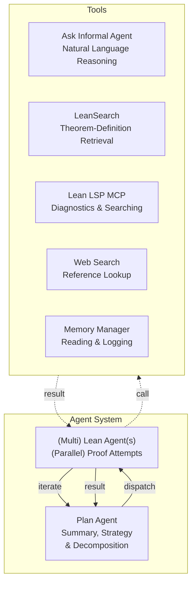

```mermaid
flowchart TD
    subgraph System["Agent System"]
        PA["Plan Agent<br/>Summary, Strategy<br/>& Decomposition"]
        PA -->|dispatch| MA["(Multi) Lean Agent(s)<br/>(Parallel) Proof Attempts"]
        MA -->|iterate| PA
        MA -->|result| PA
    end

    subgraph Tools["Tools"]
        T1["Ask Informal Agent<br/>Natural Language Reasoning"]
        T2["LeanSearch<br/>Theorem-Definition Retrieval"]
        T3["Lean LSP MCP<br/>Diagnostics & Searching"]
        T4["Web Search<br/>Reference Lookup"]
        T5["Memory Manager<br/>Reading & Logging"]
    end

    MA -.->|call| Tools
    Tools -.->|result| MA
```