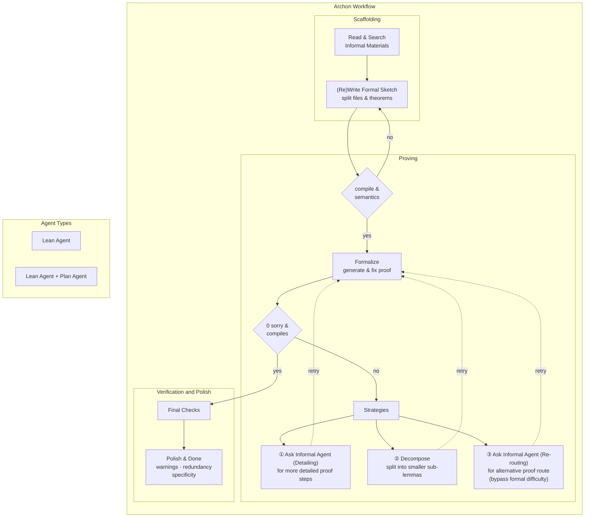

```mermaid
flowchart TD
    subgraph Phases["Archon Workflow"]
        direction TB
        
        subgraph Scaffolding["Scaffolding"]
            RS["Read & Search<br/>Informal Materials"] --> WF["(Re)Write Formal Sketch<br/>split files & theorems"]
        end

        subgraph Proving["Proving"]
            WF --> AC{"compile &<br/>semantics"}
            AC -->|no| WF
            AC -->|yes| FZ["Formalize<br/>generate & fix proof"]
            FZ --> OK{"0 sorry &<br/>compiles"}
            OK -->|no| ST["Strategies"]
            ST --> S1["① Ask Informal Agent (Detailing)<br/>for more detailed proof steps"]
            ST --> S2["② Decompose<br/>split into smaller sub-lemmas"]
            ST --> S3["③ Ask Informal Agent (Re-routing)<br/>for alternative proof route<br/>(bypass formal difficulty)"]
            S1 -.->|retry| FZ
            S2 -.->|retry| FZ
            S3 -.->|retry| FZ
        end

        subgraph VNP["Verification and Polish"]
            OK -->|yes| FC["Final Checks"]
            FC --> PD["Polish & Done<br/>warnings · redundancy<br/>specificity"]
        end
    end

    subgraph Agents["Agent Types"]
        LA["Lean Agent"]
        LAPA["Lean Agent + Plan Agent"]
    end
```