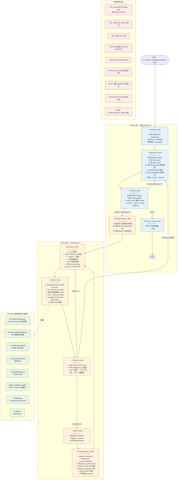

# 当前 archon-deerflow 工作流 (修正后)

> 基于 2026-05-20 代码审计。标注了 DeerFlow 已提供的基础设施。

```mermaid
flowchart TD
    START(["用户: run_unified_workflow(statement, path)"]) --> SEARCH

    subgraph RETHLAS_SIDE["Rethlas 侧 — 固定 Pipeline ⚠️"]
        direction TB
        
        SEARCH["🔍 search_node<br/>────────<br/>Matlas 优先 (8M statements)<br/>leansearch.net 回退<br/>结果拼入 messages"]
        
        GEN["📝 generator_node<br/>────────<br/>❌ 裸 model.invoke()<br/>❌ 无 bind_tools<br/>❌ 无 agent loop<br/>⚠️ 5 级 skill_prompt (规则驱动)<br/>⚠️ feedback_tier 级联<br/>⚠️ multi_path 提示 (非真并行)<br/>→ 输出 &lt;proof&gt;...&lt;/proof&gt;"]
        
        VERIFY["🔍 verifier_node<br/>────────<br/>❌ 裸 model.invoke()<br/>❌ 无 schema 验证<br/>⚠️ extract_json 解析 verdict<br/>→ correct → AUTO, wrong → retry(≤3)"]
        
        REPORT["📋 failure_report_node<br/>────────<br/>打印 3 次失败报告<br/>→ END"]
        
        SEARCH --> GEN
        GEN --> VERIFY
        VERIFY -->|"wrong + attempts < 3"| GEN
        VERIFY -->|"correct ∨ attempts ≥ 3"| AUTO
        VERIFY -->|"failed"| REPORT
        REPORT --> END_R(["END"])
    end

    subgraph ARCHON_SIDE["Archon 侧 — StateGraph ✅"]
        direction TB
        
        AUTO["🏗️ autoformalize_node<br/>────────<br/>⚠️ 简化版: 只检查项目结构<br/>❌ 不做 lemma skeleton 生成<br/>❌ 不做 theorem 签名拆分"]
        
        PLAN["📋 planner_node<br/>────────<br/>✅ LLM 驱动<br/>✅ USER_HINTS.md 读取<br/>✅ /- USER: -/ 注释<br/>✅ 5 种失败模式<br/>✅ B5 子目标分解<br/>⚠️ 不读 proof-journal<br/>⚠️ 无 task_results 文件"]
        
        PROVE["🔧 prover_node<br/>────────<br/>✅ SubagentExecutor 并行 (per-file)<br/>✅ 22 LSP tools via MCP<br/>✅ 自动化策略级联 (7/10)<br/>⚠️ 仅 1 个 prover config<br/>⚠️ subagent 无 informal agent 工具<br/>⚠️ 无 per-plan 配置"]
        
        REVIEW["📝 reviewer_node<br/>────────<br/>✅ lake build + sorry count<br/>✅ PR5 feedback_tier 级联<br/>→ Tier 1: 细化 → Tier 2: 分解 → Tier 3: 重路由"]
        
        RA["📊 review_agent_node<br/>────────<br/>✅ journal: summary / milestones / recommendations<br/>✅ PROJECT_STATUS.md<br/>✅ USER_HINTS.md 创建<br/>✅ B6 file_snapshots + diff<br/>⚠️ 无 goal state 记录<br/>⚠️ 不读历史 session"]
        
        POLISH["✨ polish_node<br/>────────<br/>⚠️ 简化版: lake build + minimize_imports<br/>❌ 不做 golf/refactor"]
        
        AUTO --> PLAN
        PLAN --> PROVE
        PROVE --> REVIEW
        REVIEW -->|"sorries > 0"| PLAN
        REVIEW -->|"COMPLETE"| POLISH
        REVIEW -->|"RETHLAS (反馈)"| GEN
        POLISH --> RA
        RA --> PLAN
    end

    subgraph INFRA["DeerFlow 基础设施 (已提供)"]
        direction LR
        I1["🔒 SandboxMiddleware<br/>acquire/release 生命周期"]
        I2["📊 TokenUsageMiddleware<br/>LLM 调用成本追踪"]
        I3["💾 JsonlRunEventStore<br/>JSONL 运行日志"]
        I4["🧠 MemoryMiddleware<br/>会话记忆"]
        I5["🔄 SubagentExecutor<br/>子 agent 并行"]
        I6["🛠️ get_available_tools()<br/>MCP + builtin 工具聚合"]
        I7["💾 SqliteSaver<br/>LangGraph checkpoint"]
        I8["🌐 Web UI<br/>Dashboard"]
    end

    PROVE -.->|"使用"| INFRA

    subgraph GAPS["现有差距标注"]
        direction LR
        G1["🔴 R1: generator 无 agent loop<br/>裸 model.invoke()"]
        G2["🔴 R2: verifier 无 schema 验证"]
        G3["🔴 R3: 只有 5/10 skills"]
        G4["🔴 R4: tools 绑在 prover 非 generator"]
        G5["🔴 R5: 无 recursive-proving"]
        G6["🟡 R6: prover config 全局单例"]
        G7["🟡 R7: 固定 pipeline 非自适应"]
        G8["🟡 R8: 无 MCP memory 持久化"]
        G9["🟡 R9: create_deerflow_agent 未用"]
    end

    classDef rethlas fill:#e3f2fd,stroke:#1565c0
    classDef archon fill:#fff3e0,stroke:#e65100
    classDef infra fill:#e8f5e9,stroke:#2e7d32
    classDef gap fill:#ffebee,stroke:#c62828
    
    class SEARCH,GEN,VERIFY,REPORT rethlas
    class AUTO,PLAN,PROVE,REVIEW,RA,POLISH archon
    class I1,I2,I3,I4,I5,I6,I7,I8 infra
    class G1,G2,G3,G4,G5,G6,G7,G8,G9 gap
```
