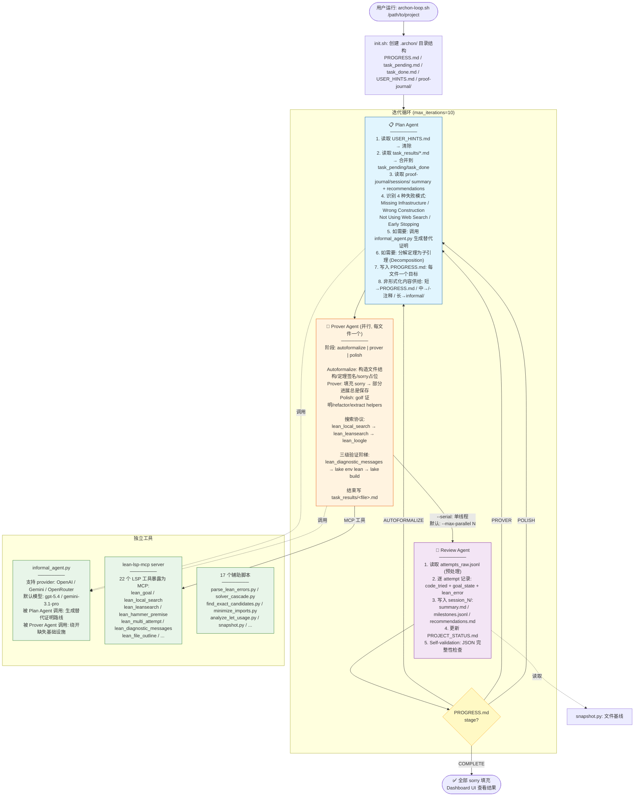

# 原版 Archon 工作流

> 来源：`archon-loop.sh` + 6 个 prompt (`plan.md`, `prover-prover.md`, `prover-autoformalize.md`, `prover-polish.md`, `review.md`, `init.md`)

```mermaid
flowchart TD
    START(["用户运行: archon-loop.sh /path/to/project"]) --> INIT
    INIT["init.sh: 创建 .archon/ 目录结构<br/>PROGRESS.md / task_pending.md / task_done.md / USER_HINTS.md / proof-journal/"] --> LOOP

    subgraph LOOP["迭代循环 (max_iterations=10)"]
        direction TB
        PLAN["📋 Plan Agent<br/>────────<br/>1. 读取 USER_HINTS.md → 清除<br/>2. 读取 task_results/*.md → 合并到 task_pending/task_done<br/>3. 读取 proof-journal/sessions/ summary + recommendations<br/>4. 识别 4 种失败模式:<br/>   Missing Infrastructure / Wrong Construction<br/>   Not Using Web Search / Early Stopping<br/>5. 如需要: 调用 informal_agent.py 生成替代证明<br/>6. 如需要: 分解定理为子引理 (Decomposition)<br/>7. 写入 PROGRESS.md: 每文件一个目标<br/>8. 非形式化内容供给: 短→PROGRESS.md / 中→/- 注释 / 长→informal/"]
        
        PROVER["🔧 Prover Agent (并行, 每文件一个)<br/>────────<br/>阶段: autoformalize | prover | polish<br/><br/>Autoformalize: 构造文件结构/定理签名/sorry占位<br/>Prover: 填充 sorry → 部分进展总是保存<br/>Polish: golf 证明/refactor/extract helpers<br/><br/>搜索协议:<br/>lean_local_search → lean_leansearch → lean_loogle<br/><br/>三级验证阶梯:<br/>lean_diagnostic_messages → lake env lean → lake build<br/><br/>结束写 task_results/&lt;file&gt;.md"]
        
        REVIEW["📝 Review Agent<br/>────────<br/>1. 读取 attempts_raw.jsonl (预处理)<br/>2. 逐 attempt 记录: code_tried + goal_state + lean_error<br/>3. 写入 session_N/:<br/>   summary.md / milestones.jsonl / recommendations.md<br/>4. 更新 PROJECT_STATUS.md<br/>5. Self-validation: JSON 完整性检查"]
        
        CHECK{"PROGRESS.md<br/>stage?"}
        
        PLAN --> PROVER
        PROVER -->|"--serial: 单线程<br/>默认: --max-parallel N"| REVIEW
        REVIEW --> CHECK
    end

    CHECK -->|"AUTOFORMALIZE"| PLAN
    CHECK -->|"PROVER"| PLAN
    CHECK -->|"POLISH"| PLAN
    CHECK -->|"COMPLETE"| DONE

    subgraph TOOLS["独立工具"]
        INFORMAL["informal_agent.py<br/>────────<br/>支持 provider: OpenAI / Gemini / OpenRouter<br/>默认模型: gpt-5.4 / gemini-3.1-pro<br/>被 Plan Agent 调用: 生成替代证明路线<br/>被 Prover Agent 调用: 绕开缺失基础设施"]
        LSP["lean-lsp-mcp server<br/>────────<br/>22 个 LSP 工具暴露为 MCP:<br/>lean_goal / lean_local_search<br/>lean_leansearch / lean_hammer_premise<br/>lean_multi_attempt / lean_diagnostic_messages<br/>lean_file_outline / ..."]
        SCRIPTS["17 个辅助脚本<br/>────────<br/>parse_lean_errors.py / solver_cascade.py<br/>find_exact_candidates.py / minimize_imports.py<br/>analyze_let_usage.py / snapshot.py / ..."]
    end

    PLAN -.->|"调用"| INFORMAL
    PROVER -.->|"调用"| INFORMAL
    PROVER -->|"MCP 工具"| LSP
    REVIEW -.->|"读取"| snapshot["snapshot.py: 文件基线"]
    DONE(["✅ 全部 sorry 填充<br/>Dashboard UI 查看结果"])

    classDef plan fill:#e1f5fe,stroke:#01579b
    classDef prove fill:#fff3e0,stroke:#e65100
    classDef review fill:#f3e5f5,stroke:#7b1fa2
    classDef tool fill:#e8f5e9,stroke:#2e7d32
    classDef decision fill:#fff9c4,stroke:#f9a825
    
    class PLAN plan
    class PROVER prove
    class REVIEW review
    class INFORMAL,LSP,SCRIPTS tool
    class CHECK,CHECK2 decision
```
