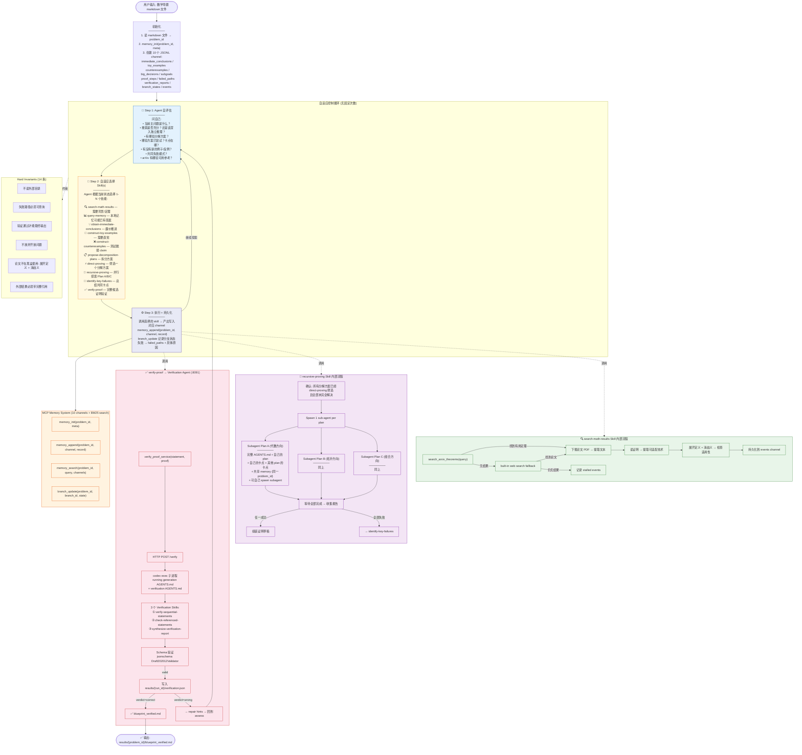

# 原版 Rethlas 工作流

> 来源：`agents/generation/AGENTS.md` + 10 Skills + `agents/verification/AGENTS.md` + 3 Skills + 2 MCP Servers + Verification API

```mermaid
flowchart TD
    INPUT(["用户输入: 数学命题 markdown 文件"]) --> INIT
    
    INIT["初始化<br/>────────<br/>1. 读 markdown 文件 → problem_id<br/>2. memory_init(problem_id, meta)<br/>3. 创建 10 个 JSONL channel:<br/>   immediate_conclusions / toy_examples<br/>   counterexamples / big_decisions / subgoals<br/>   proof_steps / failed_paths<br/>   verification_reports / branch_states / events"] --> LOOP

    subgraph LOOP["自适应控制循环 (无固定次数)"]
        direction TB
        
        ASSESS["🧠 Step 1: Agent 自评估<br/>────────<br/>问自己:<br/>• 当前主问题是什么？<br/>• 搜索是否充分？还是该深入独立推理？<br/>• 有哪些分解方案？<br/>• 哪些方案已尝试？卡点在哪？<br/>• 有没有新的例子/反例？<br/>• 共同失败模式？<br/>• arXiv 有哪些可用参考？"]
        
        CHOOSE["🎯 Step 2: 自适应选择 Skill(s)<br/>────────<br/>Agent 根据当前状态选择 1-N 个技能:<br/><br/>🔍 search-math-results — 需要背景/定理<br/>📊 query-memory — 本地记忆可能已有答案<br/>💡 obtain-immediate-conclusions — 廉价推进<br/>🧸 construct-toy-examples — 需要直觉<br/>❌ construct-counterexamples — 测试脆弱 claim<br/>📋 propose-decomposition-plans — 拆分方案<br/>⚡ direct-proving — 筛选一个分解方案<br/>🔄 recursive-proving — 并行探索 Plan A/B/C<br/>🔑 identify-key-failures — 总结共同卡点<br/>✅ verify-proof — 完整候选证明验证"]
        
        ACT["⚙️ Step 3: 执行 + 持久化<br/>────────<br/>调用选择的 skill → 产出写入对应 channel<br/>memory_append(problem_id, channel, record)<br/>branch_update 记录分支状态<br/>失败 → failed_paths + 具体原因"]
    end

    ASSESS --> CHOOSE
    CHOOSE --> ACT
    ACT -->|"继续探索"| ASSESS

    subgraph SEARCH["🔍 search-math-results Skill 内部流程"]
        direction LR
        S1["search_arxiv_theorems(query)"] -->|"找到有用定理"| S2["下载论文 PDF → 提取文本"]
        S2 --> S3["读证明 → 提取可适配技术"]
        S3 --> S4["展开定义 + 消歧义 → 检查适用性"]
        S4 --> S5["持久化到 events channel"]
        S1 -->|"无结果"| S6["built-in web search fallback"]
        S6 -->|"找到论文"| S2
        S6 -->|"仍无结果"| S7["记录 stalled events"]
    end

    ACT -.->|"调用"| SEARCH

    subgraph RECURSIVE["🔄 recursive-proving Skill 内部流程"]
        direction TB
        R1["确认: 所有分解方案已经 direct-proving 筛选<br/>且全部未完全解决"] --> R2["Spawn 1 sub-agent per plan"]
        R2 --> R3A & R3B & R3C
        R3A["Subagent Plan A (代数方向)<br/>────────<br/>完整 AGENTS.md + 自己的 plan<br/>+ 自己的卡点 + 其他 plan 的卡点<br/>+ 共享 memory (同一 problem_id)<br/>+ 可自己 spawn subagent"]
        R3B["Subagent Plan B (拓扑方向)<br/>────────<br/>同上"]
        R3C["Subagent Plan C (组合方向)<br/>────────<br/>同上"]
        R3A & R3B & R3C --> R4["等待全部完成 → 收集报告"]
        R4 -->|"任一成功"| R5["组装证明草稿"]
        R4 -->|"全部失败"| R6["→ identify-key-failures"]
    end

    ACT -.->|"调用"| RECURSIVE

    subgraph VERIFY["✅ verify-proof → Verification Agent (:8091)"]
        direction TB
        V1["verify_proof_service(statement, proof)"] --> V2["HTTP POST /verify"]
        V2 --> V3["codex exec 子进程<br/>running generation AGENTS.md<br/>+ verification AGENTS.md"]
        V3 --> V4["3 个 Verification Skills:<br/>① verify-sequential-statements<br/>② check-referenced-statements<br/>③ synthesize-verification-report"]
        V4 --> V5["Schema 验证<br/>jsonschema Draft202012Validator"]
        V5 -->|"valid"| V6["写入 results/{run_id}/verification.json"]
        V6 -->|"verdict=correct"| V7["✅ blueprint_verified.md"]
        V6 -->|"verdict=wrong"| V8["→ repair hints → 回到 assess"]
    end

    ACT -.->|"调用"| VERIFY

    V7 --> DONE
    V8 --> ASSESS

    DONE(["✅ 输出: results/{problem_id}/blueprint_verified.md"])

    subgraph MEMORY["MCP Memory System (10 channels + BM25 search)"]
        M1["memory_init(problem_id, meta)"]
        M2["memory_append(problem_id, channel, record)"]
        M3["memory_search(problem_id, query, channels)"]
        M4["branch_update(problem_id, branch_id, state)"]
    end

    ACT --> MEMORY

    subgraph CONSTRAINTS["Hard Invariants (14 条)"]
        C1["不读外部目录"]
        C2["失败路径必须可查询"]
        C3["验证通过才能最终输出"]
        C4["不放弃开放问题"]
        C5["论文不在黑盒使用: 展开定义 + 消歧义"]
        C6["外部结果必须带完整引用"]
    end

    LOOP -.->|"约束"| CONSTRAINTS

    classDef assess fill:#e3f2fd,stroke:#1565c0
    classDef choose fill:#fff8e1,stroke:#f57f17
    classDef act fill:#e8eaf6,stroke:#4527a0
    classDef search fill:#e8f5e9,stroke:#2e7d32
    classDef verify fill:#fce4ec,stroke:#c62828
    classDef memory fill:#fff3e0,stroke:#e65100
    classDef recursive fill:#f3e5f5,stroke:#7b1fa2
    
    class ASSESS assess
    class CHOOSE choose
    class ACT act
    class SEARCH,S1,S2,S3,S4,S5,S6,S7 search
    class VERIFY,V1,V2,V3,V4,V5,V6,V7,V8 verify
    class MEMORY,M1,M2,M3,M4 memory
    class RECURSIVE,R1,R2,R3A,R3B,R3C,R4,R5,R6 recursive
```
