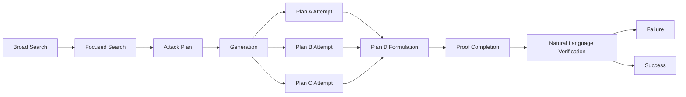

```mermaid
flowchart LR
    BS["Broad Search"] --> FS["Focused Search"]
    FS --> AP["Attack Plan"]
    AP --> GN["Generation"]

    GN --> PA["Plan A Attempt"]
    GN --> PB["Plan B Attempt"]
    GN --> PC["Plan C Attempt"]

    PA --> PD["Plan D Formulation"]
    PB --> PD
    PC --> PD

    PD --> PC2["Proof Completion"]

    PC2 --> NV["Natural Language Verification"]

    NV --> F["Failure"]
    NV --> S["Success"]
```