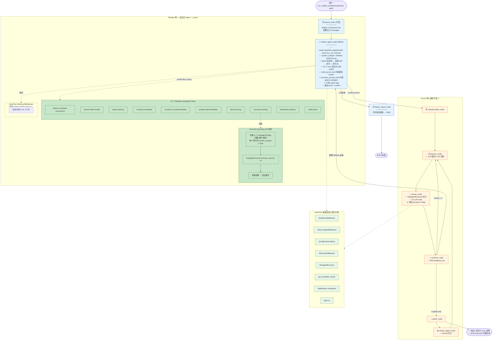

# 目标架构：archon-deerflow 改造后 (使用 create_deerflow_agent)

> Rethlas 侧从固定 pipeline 替换为自适应 agent loop; Archon 侧保持不变

```mermaid
flowchart TD
    START(["用户: run_unified_workflow(statement, path)"]) --> SEARCH

    subgraph RETHLAS_SIDE["Rethlas 侧 — 自适应 Agent ✅ (new!)"]
        direction TB
        
        SEARCH["🔍 search_node (不变)<br/>────────<br/>Matlas / leansearch.net<br/>结果注入 messages"]
        
        AGENT["🤖 rethlas_agent_node (NEW!)<br/>────────<br/>✅ create_deerflow_agent(model, tools=ALL_10_TOOLS)<br/>✅ system_prompt = Rethlas AGENTS.md<br/>✅ Agent 自评估 → 选择 skill → 执行 → 持久化<br/>✅ 10 个 tool 全部 bind 到 model<br/>✅ verify_proof_tool 内部调用 verifier<br/>✅ recursive_proving_tool 内部 spawn subagent<br/>✅ ≤3 轮 repair loop<br/>→ 输出 proof + verdict"]
        
        SEARCH --> AGENT
        
        subgraph TOOLS["10 个 Rethlas LangChain Tools"]
            direction LR
            T1["obtain-immediate-conclusions"]
            T2["search-math-results"]
            T3["query-memory"]
            T4["construct-examples"]
            T5["construct-counterexamples"]
            T6["propose-decomposition"]
            T7["direct-proving"]
            T8["recursive-proving"]
            T9["identify-key-failures"]
            T10["verify-proof"]
        end
        
        AGENT -.->|"model.bind_tools()"| TOOLS

        subgraph RECURSIVE["recursive_proving_tool 内部"]
            direction TB
            RR1["创建 3 个 SubagentConfig<br/>(代数/拓扑/组合)<br/>每个有不同 system_prompt + tools"] --> RR2["SubagentExecutor.execute_async() ×3"]
            RR2 --> RR3["收集结果 → 选出最优"]
        end

        T8 -.->|"调用"| RECURSIVE

        subgraph MEMORY["DeerFlow MemoryMiddleware<br/>(替代 Rethlas MCP memory)"]
            M1["自动记录 LLM 上下文"]
        end

        AGENT -.->|"使用"| MEMORY
    end

    AGENT -->|"verdict=correct"| AUTO
    AGENT -->|"3 次失败"| REPORT

    REPORT["📋 failure_report_node<br/>────────<br/>打印失败报告 → END"]
    REPORT --> END_R(["END (失败)"])

    subgraph ARCHON_SIDE["Archon 侧 (保持不变) ✅"]
        direction TB
        
        AUTO["🏗️ autoformalize_node"]
        PLAN["📋 planner_node<br/>✅ LLM 驱动 + B5 分解"]
        PROVE["🔧 prover_node<br/>✅ SubagentExecutor 并行<br/>✅ 22 LSP tools<br/>⚠️ 待加 per-plan config"]
        REVIEW["📝 reviewer_node<br/>✅ PR5 feedback_tier"]
        RA["📊 review_agent_node<br/>✅ journal 写入"]
        POLISH["✨ polish_node"]
        
        AUTO --> PLAN
        PLAN --> PROVE
        PROVE --> REVIEW
        REVIEW -->|"sorries > 0"| PLAN
        REVIEW -->|"COMPLETE"| POLISH
        REVIEW -->|"需要 Rethlas 反馈"| AGENT
        POLISH --> RA
        RA --> PLAN
    end

    subgraph INFRA["DeerFlow 基础设施 (全部可用)"]
        I1["SandboxMiddleware"] 
        I2["TokenUsageMiddleware"]
        I3["JsonlRunEventStore"]
        I4["MemoryMiddleware"]
        I5["SubagentExecutor"]
        I6["get_available_tools()"]
        I7["SqliteSaver checkpoint"]
        I8["Web UI"]
    end

    PROVE -.-> INFRA
    AGENT -.-> INFRA

    DONE(["✅ 输出: 形式化 Lean 证明<br/>+ .archon-journal/ 完整记录"])

    POLISH --> DONE

    classDef rethlas fill:#e3f2fd,stroke:#1565c0
    classDef archon fill:#fff3e0,stroke:#e65100
    classDef new fill:#c8e6c9,stroke:#2e7d32
    classDef infra fill:#e8f5e9,stroke:#388e3c
    
    class SEARCH,AGENT,REPORT rethlas
    class TOOLS,T1,T2,T3,T4,T5,T6,T7,T8,T9,T10,RECURSIVE,RR1,RR2,RR3 new
    class AUTO,PLAN,PROVE,REVIEW,RA,POLISH archon
    class I1,I2,I3,I4,I5,I6,I7,I8 infra
```
