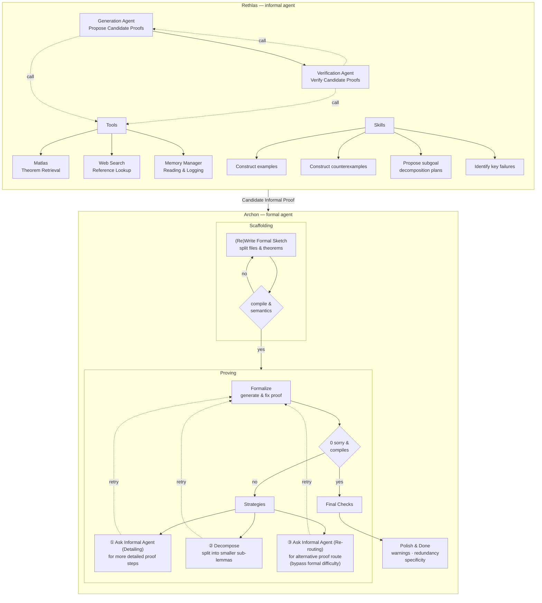

```mermaid
flowchart TD
    subgraph Rethlas["Rethlas — informal agent"]
        direction TB
        GA["Generation Agent<br/>Propose Candidate Proofs"] --> VA["Verification Agent<br/>Verify Candidate Proofs"]
        VA -. "call" .-> GA
        GA -.->|"call"| RT["Tools"]
        VA -.->|"call"| RT
        RT --> MAT["Matlas<br/>Theorem Retrieval"]
        RT --> WS["Web Search<br/>Reference Lookup"]
        RT --> MM["Memory Manager<br/>Reading & Logging"]
        SK["Skills"] --> SK1["Construct examples"]
        SK --> SK2["Construct counterexamples"]
        SK --> SK3["Propose subgoal<br/>decomposition plans"]
        SK --> SK4["Identify key failures"]
    end

    Rethlas -->|"Candidate Informal Proof"| Archon

    subgraph Archon["Archon — formal agent"]
        direction TB
        subgraph A_Scaffolding["Scaffolding"]
            RS["(Re)Write Formal Sketch<br/>split files & theorems"] --> AC{"compile &<br/>semantics"}
        end
        AC -->|no| RS
        AC -->|yes| A_Proving["Proving"]
        subgraph A_Proving["Proving"]
            FZ["Formalize<br/>generate & fix proof"] --> OK{"0 sorry &<br/>compiles"}
            OK -->|no| ST["Strategies"]
            OK -->|yes| FC["Final Checks"]
            ST --> S1["① Ask Informal Agent (Detailing)<br/>for more detailed proof steps"]
            ST --> S2["② Decompose<br/>split into smaller sub-lemmas"]
            ST --> S3["③ Ask Informal Agent (Re-routing)<br/>for alternative proof route<br/>(bypass formal difficulty)"]
            S1 -.->|retry| FZ
            S2 -.->|retry| FZ
            S3 -.->|retry| FZ
        end
        FC --> PD["Polish & Done<br/>warnings · redundancy<br/>specificity"]
    end
```