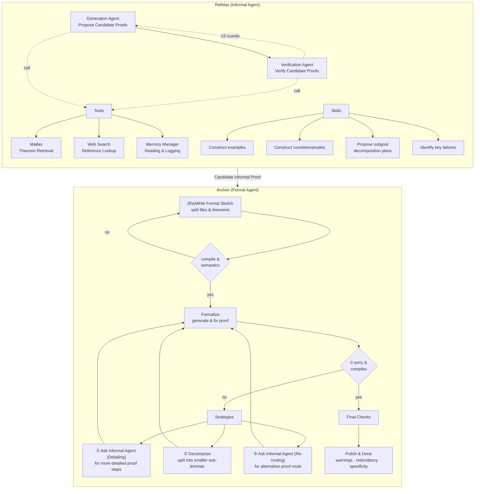
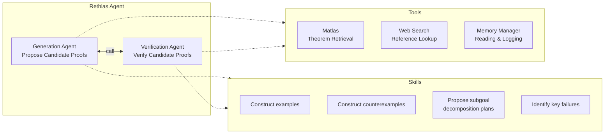
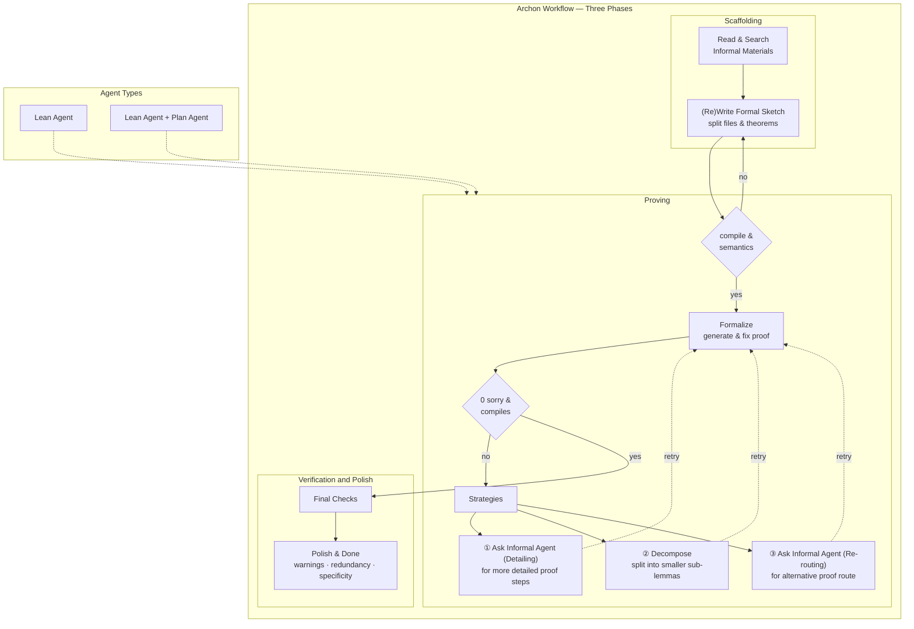
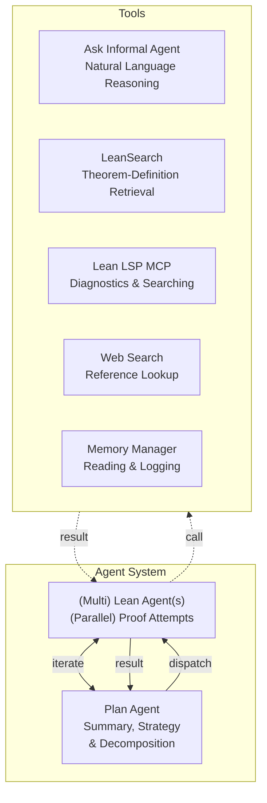
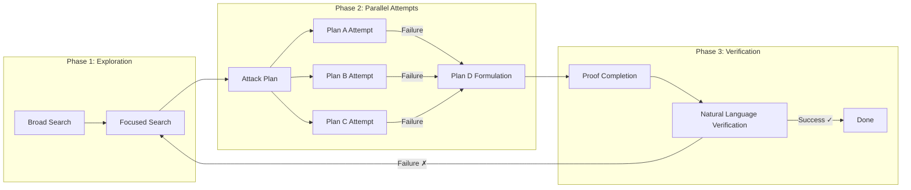
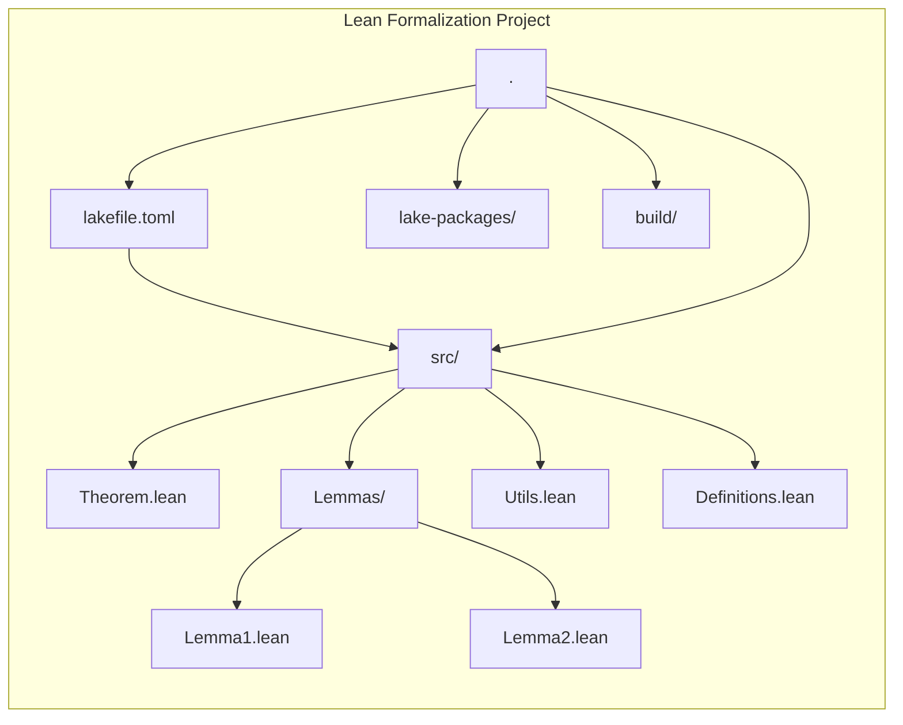

*This paper is now available on arXiv: [arXiv:2604.03789](https://arxiv.org/abs/2604.03789). The following is a reformatted version of the main text (excluding appendices), with content identical to the original.*

*All code and results related to this work are fully open-sourced: the formalization results are available at [Anderson-Conjecture](https://github.com/frenzymath/Anderson-Conjecture), the informal agent Rethlas at [Rethlas](https://github.com/frenzymath/Rethlas), and the formal agent Archon at [Archon](https://github.com/frenzymath/Archon).*

## Abstract

Recent advances in large language models (LLMs) have significantly improved their ability to perform mathematical reasoning, extending from elementary problem solving to increasingly capable performance on research-level problems. However, reliably solving and verifying such problems remains challenging due to the inherent ambiguity of natural language reasoning and the need for rigorous validation. In this paper, we propose an automated framework for tackling research-level mathematical problems that integrates natural language reasoning with formal verification, enabling end-to-end problem solving with minimal human intervention. Our framework consists of two components: an informal reasoning agent, Rethlas, and a formal verification agent, Archon. Rethlas mimics the workflow of human mathematicians by combining reasoning primitives with our mathematical theorem search engine, Matlas, to explore solution strategies and construct candidate proofs. Archon, equipped with our formal theorem search engine LeanSearch, translates informal arguments into fully formalized Lean 4 projects through structured task decomposition, iterative refinement, and automated proof synthesis, ensuring machine-checkable correctness. Using this framework, we automatically resolve an open problem in commutative algebra proposed by D. D. Anderson (2014) and formally verify the resulting proof in Lean 4 with essentially no human involvement. Our experiments demonstrate that strong theorem retrieval tools enable the discovery and application of deep, cross-domain mathematical techniques, while the formal agent is capable of autonomously filling nontrivial gaps in informal arguments. More broadly, our work illustrates a promising paradigm for mathematical research in which informal and formal reasoning systems, equipped with theorem retrieval tools, operate in tandem to produce verifiable results, substantially reduce human effort, and offer a concrete instantiation of human–AI collaborative mathematical research with minimal human involvement.

## Introduction

In recent years, the mathematical reasoning abilities of large language models (LLMs) have advanced rapidly, progressing from handling elementary arithmetic and high-school–level problems to demonstrating competence across undergraduate curricula and beginning to engage with graduate- and research-level mathematics. Early models such as GPT-3 struggled with basic arithmetic, whereas GPT-4 ([Achiam et al., 2023](https://arxiv.org/abs/2303.08774)) achieved a high score (92%) on the grade-school benchmark GSM8K. With the emergence of *test-time scaling*, where models allocate increased computational resources to reasoning during inference, systems such as OpenAI’s o1 have shown strong performance on high-school competition problems, including AIME. Subsequent reasoning models ([Guo et al., 2025](https://arxiv.org/abs/2501.12948); [QwQ-32B, 2025](https://qwenlm.github.io/blog/qwq-32b/); [Yang et al., 2025](https://arxiv.org/abs/2505.09388); [Comanici et al., 2025](https://arxiv.org/abs/2507.06261)) have further validated the effectiveness of this paradigm. A notable milestone was achieved by Google’s Gemini Deep Think, which reached gold-medal–level performance at the International Mathematical Olympiad (IMO) using purely natural-language reasoning.

At a higher level, recent studies suggest that LLMs have also become increasingly capable in undergraduate and graduate mathematics, while continuing to make progress on research-level problems. For example, [Ju and Dong, 2026](https://arxiv.org/abs/2601.13209) showed that frontier models available at the time, such as Gemini 2.5 Pro, scored above 90 on a benchmark of undergraduate mathematics exams. The same study also found that o3-mini achieved an average score above 80 on PhD qualifying exams in Analysis, Probability, Algebra, and Geometry & Topology. Open-source models have also demonstrated strong performance; for instance, [Jiang et al., 2025](https://arxiv.org/abs/2511.02872) reported that DeepSeek-R1 achieves 71.0% proof accuracy on graduate-level algebra tasks. At the research level, progress is ongoing. On the *FrontierMath* benchmark ([Glazer et al., 2024](https://arxiv.org/abs/2411.04872)), whose Tier 4 consists of unpublished research-level problems, o3-mini achieves only 4% pass@1 accuracy, whereas GPT-5 improves this to 15%. More recently, the leading system, GPT-5.4-Pro (web), reaches 38% pass@1 accuracy. Notably, GPT-5.4-Pro has also solved an open problem in combinatorics from *FrontierMath* that is categorized as “moderately interesting”. Building on these frontier models, LLM-based agents equipped with appropriate harness engineering can further enhance performance. For example, the *Aletheia* agent ([Feng et al., 2026](https://arxiv.org/abs/2602.10177)), which integrates a generator, a verifier, and a reviser, has autonomously tackled four Erdős problems ([Feng et al., 2026](https://arxiv.org/abs/2601.22401)) and addressed research questions such as computing eigenweights for the Arithmetic Hirzebruch Proportionality Principle ([Feng, 2026](https://arxiv.org/abs/2601.23245)), as well as problems concerning the simplicity of the Hodge bundle ([Patel, 2026](https://arxiv.org/abs/2603.19052)).

However, despite these advances, evaluating the research-level capabilities of LLMs and LLM-based agents remains a significant bottleneck that requires substantial human effort. As mathematical complexity increases, evaluation increasingly relies on domain experts; however, due to the inherent imprecision of natural language, even experienced mathematicians can occasionally misjudge arguments. Indeed, errors can persist even within the rigorous peer-review processes of top journals. To enable fast and reliable verification of mathematical reasoning, it is therefore necessary to move toward more mechanized and unambiguous frameworks. Formal systems provide precisely such a foundation: a precise symbolic language paired with rigorously defined mechanisms for constructing and verifying proofs. Once a mathematical argument is translated into a formal language while preserving its semantic content, its correctness can be verified with complete rigor.

Motivated by this, we propose a framework for autonomously tackling and verifying research-level mathematics that integrates a natural language reasoning agent with a formalization agent, enabling end-to-end problem solving with minimal human supervision. The informal agent, [Rethlas](https://github.com/frenzymath/Rethlas), is designed to mimic the workflow of human mathematicians and is equipped with tools such as theorem retrieval to explore candidate solution paths. The formal agent, [Archon](https://github.com/frenzymath/Archon), builds on a dual-agent, tool-augmented architecture and is equipped with our formal theorem search engine LeanSearch ([Gao et al., 2024](https://arxiv.org/abs/2403.13310)). It transforms informal proofs into fully verified Lean 4 projects through structured planning, iterative formalization, and persistent memory management, ensuring both correctness and scalability.

Using this framework, we automatically resolve an open problem in commutative algebra proposed by D. D. Anderson in 2014 ([Cahen et al., 2014](https://link.springer.com/chapter/10.1007/978-1-4939-0925-4_20)) and formally verify the resulting proof in Lean 4 with essentially no human intervention. During the natural language solving phase, the semantic theorem search engine Matlas, employed by Rethlas, plays a crucial role in discovering a key technical result by Jensen ([2006](https://doi.org/10.1080/00927870500346321)). During formalization, Archon demonstrates its strong mathematical capability by filling non-trivial gaps left in the references and the natural language proof. The formalization has passed the check of [Comparator](https://github.com/leanprover/comparator).

The remainder of the paper is organized as follows. In Section 2, we review related work on agents for natural language and formal reasoning. Section 3 provides an overview of our framework. Experimental results for informal proof generation are presented in Section 4, while formalization results are discussed in Section 5. Finally, Section 6 concludes the paper.

## Related Work

### Agents for Natural Language Reasoning

LLM-based agents have recently demonstrated strong performance in both high-school olympiad mathematics and research-level mathematics. In the context of olympiad mathematics, a representative work is [Huang and Yang, 2025](https://arxiv.org/abs/2507.15855), which proposes a verification-and-refinement pipeline that successfully solves 5 out of 6 problems from the IMO 2025 using models such as Gemini 2.5 Pro, Grok-4, and GPT-5. This significantly surpasses the baseline performance of these models without such a structured workflow.

At the research level, the *Aletheia* agent ([Feng et al., 2026](https://arxiv.org/abs/2602.10177)), built upon an advanced version of Gemini Deep Think, operates through an iterative process involving a generator, a verifier, and a reviser. It has tackled four Erdős problems in an autonomous manner ([Feng et al., 2026](https://arxiv.org/abs/2601.22401)), as well as a generalized Erdős problem in a semi-autonomous setting with human collaboration ([Barreto et al., 2026](https://arxiv.org/abs/2601.21442)). Beyond these, *Aletheia* has also addressed genuine research problems, including computing eigenweights for the Arithmetic Hirzebruch Proportionality Principle ([Feng, 2026](https://arxiv.org/abs/2601.23245)) and establishing bounds for independence sets ([Lee and Seo, 2026](https://arxiv.org/abs/2602.02450)). Furthermore, *Aletheia* solved 6 out of 10 problems in the FirstProof benchmark ([Feng et al., 2026](https://arxiv.org/abs/2602.21201)), introduced in [Abouzaid et al., 2026](https://arxiv.org/abs/2602.05192), which consists of real research problems solved by human mathematicians but not publicly released at the time of evaluation. In parallel, the *FullProof* system ([Bryan et al., 2026](https://arxiv.org/abs/2601.07222)) demonstrates effective human–AI collaboration in algebraic geometry: the AI handles special cases, humans provide insights for the general case, and the AI subsequently completes the general solution based on these hints.

### Agents for Formal Reasoning

Several agent systems targeting Lean 4 have recently achieved strong results on competition-level benchmarks. AlphaProof ([Hubert et al., 2025](https://www.nature.com/articles/s41586-025-09833-y)), the pioneering RL-based agent from Google DeepMind, achieved silver-medal performance at IMO 2024. Seed-Prover 1.5 ([Chen et al., 2025](https://arxiv.org/abs/2512.17260)) trains tool-calling capabilities directly into the model and solves 11 of 12 Putnam 2025 problems. AxiomProver ([Breen et al., 2025](https://arxiv.org/abs/2510.12787)) and the open-source Numina-Lean-Agent ([Liu et al., 2026](https://arxiv.org/abs/2601.14027)) each solve all 12. Harmonic’s Aristotle ([Achim et al., 2025](https://arxiv.org/abs/2510.01346)), which augments a fine-tuned proof-search model with MCTS and an informal reasoning pipeline, achieves IMO 2025 gold-medal performance and offers a public API to the community.

Beyond competition benchmarks, several of these systems have demonstrated research-level capabilities. Aristotle and AxiomProver have each formalized solutions to open Erdős problems in Lean; AxiomProver has also solved and formalized open research conjectures such as Fel’s conjecture on syzygies of numerical semigroups ([Chen et al., 2026](https://arxiv.org/abs/2602.03716)). With greater human involvement, Numina-Lean-Agent collaboratively formalized the Brascamp–Lieb theorem with two human experts ([Liu et al., 2026](https://arxiv.org/abs/2601.14027)), and the VML project ([Ilin, 2026](https://arxiv.org/abs/2603.15929)) formalizes a result in mathematical physics with a single mathematician providing interactive guidance over ten days. At a larger scale, Math, Inc.’s Gauss ([Math, Inc., 2026](https://math.inc/sphere-packing)) produces approximately 200,000 lines of Lean code to formally verify the Fields-Medal-winning sphere packing proofs; for dimension 8, Gauss built upon a human-prepared blueprint pre-existing repository, while dimension 24 was autoformalized from the original paper. On the tooling side, Mistral’s Leanstral ([Mistral AI, 2026](https://mistral.ai/news/leanstral)) offers an open-source agent designed for proof engineering in research-level formalization projects.

## Overview of the Framework

Figure 1: Overview of the framework pipeline.

In this section, we describe our framework for autonomously tackling and verifying research-level mathematics. The framework consists of an informal agent (Rethlas), which first generates a candidate proof that is potentially correct, and a formal agent (Archon), which translates this informal proof into the formal language Lean 4 and fills in any gaps during the formalization process (see Figure 1). The design of the informal agent Rethlas is presented in Section 3.1, and the design of the formal agent Archon is presented in Section 3.2.

### Rethlas: The Informal Agent

Rethlas consists of two subagents: a generation agent and a verification agent. As shown in Figure 2, it operates in an iterative process in which the generation agent produces an informal proof and passes it to the verification agent for correctness checking. If the proof passes verification, it is considered a candidate informal proof and the process terminates. Otherwise, the verification agent provides feedback, which is passed back to the generation agent to revise the proof.

**Generation agent.** The generation agent is designed to mimic the workflow of human mathematicians and is equipped with skills and tools tailored to mathematical research. These skills consist of reasoning primitives distilled from the processes mathematicians employ when tackling research problems, and they include:

+   *Construct toy examples.* This skill is used when reasoning becomes stalled and simpler instances are needed to regain traction. The constructed examples should satisfy both the assumptions and the conclusion, allowing one to observe how the assumptions take effect and to develop intuition. When applying this skill, one should look for recurring patterns, invariants, or potential proof strategies suggested by the examples. Reasoning, decomposition, and retrieval may also be used to identify suitable examples or simplify the setting.
+   *Construct counterexamples.* This skill is used when a conjecture or intermediate claim appears fragile or insufficiently justified. The goal is to test whether the assumptions can hold while the conclusion fails. When applying this skill, one should leverage reasoning, decomposition, and retrieval to identify standard obstructions, pathological constructions, or known counterexamples.
+   *Search relevant results.* This skill is used to obtain theorems, constructions, examples, counterexamples, or background knowledge relevant to the current problem. It is also useful when constructing examples or counterexamples, or when proving subgoals that require supporting references. When a potentially useful theorem is found, one should expand the definitions and concepts involved using the surrounding context of the source, carefully verify its applicability to the current setting, and be explicit about any shifts in terminology across contexts. In addition, one should not stop at the statement alone, but also examine the proof to extract useful techniques, constructions, reductions, or proof patterns.
+   *Propose subgoal decomposition plans.* This skill is used after gathering sufficient insight from examples, counterexamples, search results, and prior attempts.
+   *Direct proving.* This skill is applied once one or more decomposition plans are available. Each plan is evaluated by attempting to prove its subgoals directly, while identifying key obstacles if the plan does not fully succeed.
+   *Recursive proving.* This skill is used when all current decomposition plans have been attempted via direct proving but none fully succeed. In this case, multiple subagents are deployed in parallel, each assigned a decomposition plan together with its associated key difficulties and those identified in other plans. Each subagent may refine, extend, or locally revise its assigned plan, while maintaining continuity rather than discarding it entirely.
+   *Identify key failures.* This skill is used when recursive attempts across all decomposition plans fail. The objective is to identify common patterns in these failures, such as recurring obstructions, ineffective decomposition strategies, or missing background knowledge. These insights are then summarized to guide the next iteration of plan generation.

Figure 2: Rethlas Agent.

As reflected in the above descriptions, these skills are not isolated but interconnected. Applying one skill often involves elements of others. For example, constructing examples and counterexamples does not occur in isolation; it typically requires reasoning, problem decomposition, and retrieval to identify appropriate constructions. When tackling a math problem, the agent is instructed to assess the current state and choose appropriate skills to apply, rather than deciding a fixed order of skills beforehand.

Among the tools used in Rethlas, our theorem search engine Matlas[1](#user-content-fn-1) plays a central role. In our experiments, Matlas serves as a semantic search engine over mathematical statements from arXiv, including definitions, propositions, theorems, corollaries, examples, and remarks. Its corpus contains approximately 13.6 million such statements, each embedded into a vector database. Given a query in the form of a mathematical statement, Matlas embeds the query and performs nearest-neighbor search using cosine similarity to retrieve relevant results. Compared to general web search, Matlas provides a more fine-grained and principled retrieval mechanism tailored to mathematical content. Although its corpus is smaller, it is more structured and enables more precise identification of relevant statements. When applying the `search-math-results` skill, Rethlas is instructed to first query Matlas and retrieve relevant theorems, examples, or counterexamples. It may then use web search either to gather additional background information and terminology, or to further explore references suggested by the results returned by Matlas.

In addition, Rethlas maintains a working memory of intermediate artifacts generated during the reasoning process, such as constructed examples, counterexamples, and subgoal decomposition plans. The agent is instructed to write these artifacts to memory and to query this memory when needed, enabling the reuse of previously generated insights and improving coherence across reasoning steps. In our experiments, the generation agent is implemented using the OpenAI Codex agent framework, with GPT-5.4 as the underlying base model.

**Verification agent.** The verification agent is equipped with skills for checking the correctness of mathematical proofs. These include verifying statements sequentially, such as examining skipped or hand-wavy steps, identifying critical errors and gaps, and carefully assessing whether apparently unused assumptions are genuinely redundant or instead indicate an omitted argument. They also include confirming referenced statements, by checking, using our theorem search tool Matlas and web search, whether a cited statement exists and is applicable in the current context, expanding the definitions and terminology in the cited statement using the context of the source paper, and ensuring that terms used in the current proof carry the same meaning as in the cited source, since identical words may have different definitions in different contexts. In our experiments, the verification agent is implemented using the OpenAI Codex agent with GPT-5.4 as the underlying model.

### Archon: The Formal Agent

Mathematical proofs demand complete rigor, yet even expert-written proofs may contain subtle flaws, and proofs produced by LLMs, which are prone to hallucination, are far less reliable. To obtain trustworthy guarantees of correctness, we introduce formal verification into the pipeline. If a proof passes the formal language compiler, then verifying correctness reduces to checking that the top-level statement and its supporting definitions faithfully capture the intended mathematical content.

We adopt Lean 4 as our formal language. Its community-maintained library Mathlib comprises over 267,000 theorems and 127,000 definitions contributed by more than 770 members, providing a well-established foundation that makes formalization of frontier mathematics feasible, as every dependent definition and lemma must ultimately be grounded in existing libraries.

The formal agent, *Archon*, extends our prior work on statement autoformalization ([Gao et al., 2024](https://arxiv.org/abs/2410.10878); [Wang et al., 2025](https://arxiv.org/abs/2510.04520)) to full proof formalization: given an informal proof, it produces a Lean 4 project that states and proves the target theorem together with all supporting definitions and lemmas, grounded in Mathlib. Archon first initializes the project by collecting dependent references, then formalizes key statements and definitions, organizing them into topic-specific files. It proceeds iteratively, filling gaps omitted in the literature, consulting the informal agent or external sources when stuck, and exploring alternative formalization strategies until the entire project compiles.

Prior to deployment on proofs generated by Rethlas, we validated Archon on FirstProof ([Abouzaid et al., 2026](https://arxiv.org/abs/2602.05192)), a collection of 10 research-level problems without publicly released solutions at the time, avoiding data contamination. Both OpenAI ([OpenAI, 2026](https://cdn.openai.com/pdf/26177a73-3b75-4828-8c91-e8f1cf27aaa0/oai_first_proof.pdf)) and Google ([Feng et al., 2026](https://arxiv.org/abs/2602.21201)) evaluated their systems on these problems. We selected Problems 4 and 6 based on Mathlib infrastructure support and mathematical significance; notably, Google’s Aletheia failed on both, while OpenAI succeeded but with human supervision. Archon produced complete formalizations of OpenAI’s informal proofs for both problems: Problem 6 was formalized fully autonomously, and Problem 4 required only a single natural-language hint on the proof direction for one lemma. Formalization of Problem 4 took approximately 50 hours and 1200 dollars in API costs; Problem 6 took 30 hours and 750 dollars. (For more details, see our blog post at [Archon-FirstProof](https://frenzymath.com/blog/archon-firstproof/).) The following sections review the workflow and architecture, and describe enhancements since our initial release.

#### System Architecture and Workflow Design

Figure 3: Archon Workflow

Figure 4: Agent System and Tools

Our core design principle is to avoid hard-coded workflows and instead equip the agent with sufficient skills and tools, granting it maximal autonomy. However, we observed that in long-running sessions, particularly when the agent confronts difficult lemmas, accumulated context degrades performance: the agent’s own failed attempts and pessimistic annotations erode its willingness to persevere. To address this, we introduced a dual-agent architecture consisting of a **Plan Agent**, which operates in a fresh context to decompose tasks and provide targeted guidance, and a **Lean Agent**, which executes formalization within a constrained scope. This separation substantially mitigates context pollution and task-aversion (e.g., context containing accumulated failures was observed to correlate with reduced agent persistence on difficult obligations).

The formalization process is divided into three phases (Figure 3):

1.  **Scaffolding.** The Lean Agent analyzes the informal proof and constructs the initial file structure: splitting the proof into modules, defining theorem signatures, and placing `sorry` placeholders at each proof obligation. This decomposition is not fixed and may be revised as the proof develops.
2.  **Proving.** The Lean Agent and Plan Agent enter an iterative cycle. The Lean Agent attempts to discharge `sorry` placeholders; when stuck, it returns diagnostics to the Plan Agent, which re-evaluates the proof strategy and dispatches a revised task. When the decomposition yields independent proof obligations, multiple Lean Agents can operate in parallel.
3.  **Verification and Polish.** The system confirms successful compilation and the absence of `sorry`, `axiom`, and other escape hatches, then performs a quality pass to extract reusable lemmas and reduce proof complexity.

As shown in Figure 4, the agents are equipped with a suite of tools implemented via terminal CLI and Model Context Protocols (MCPs). We highlight two that are particularly important to Archon’s effectiveness:

**Ask Informal Agent.** When the Lean Agent requires mathematical guidance beyond what the provided informal proof covers, it delegates to an informal agent for natural-language sub-proofs or alternative strategies. In most cases, this is a lightweight Gemini API call for quick reasoning. When the agent encounters a more substantial obstacle, it may invoke Rethlas for deeper, long-horizon reasoning.

**LeanSearch.** Our previously published retrieval tool, widely adopted in the Lean community, provides fuzzy search over Mathlib’s theorems and definitions. For Archon, we further improved its retrieval accuracy and updated it to the latest Lean and Mathlib versions. Crucially, LeanSearch enables the agent to reliably determine whether a needed result already exists in Mathlib, allowing it to make well-informed decisions about when to invoke library lemmas and when to formalize from scratch. This capability is essential for producing formalizations that fully leverage existing infrastructure.

Other tools include a Lean LSP MCP for compilation diagnostics, web search for retrieving published references, and a memory management system that persists the agent’s architectural reasoning, failed approaches, and learned techniques across context compressions and session restarts.

Providing tools alone is not sufficient; the model also requires explicit guidance on when and how to deploy them. This behavioral guidance is encoded in **skills**, structured instruction files built upon the Lean 4 Skills framework, that shape the agent’s working patterns and corner-case handling to mirror authentic formalization practice.

#### Enhancements for Conjecture Formalization

The version of Archon used for FirstProof Problems 4 and 6 validated the dual-agent architecture: the Plan Agent largely eliminated cases where the Lean Agent stalled or refused to push forward. However, scaling to harder problems revealed two further challenges. First, as mathematical difficulty and project complexity grow, agents occasionally lose track of prior attempts and repeatedly explore the same dead ends, wasting computational resources. Second, as the project enlarges, agents must manage a growing body of informal references and can struggle to locate them when needed. We introduce two enhancements, both open-sourced, to address these issues.

**Memory system and Review Agent.** We shorten the duration of each Lean–Plan iteration and require each agent to log a summary of its session. Several global status documents are maintained across sessions, tracking the overall workflow stage, per-file proving status, and detailed records of local `sorry` elimination and refactoring work. Additionally, a **Review Agent** runs at each session boundary to synthesize trends across recent sessions. This multi-session perspective is essential for detecting stalls, which only manifest as patterns over consecutive sessions. While the Review Agent does not alter the formalization itself, it enables the Plan Agent to adjust strategy at the right time and gives human experts a clearer view of progress.

**Structured prompts and reference management.** We reorganize the agent’s guidance and reference materials into a clear directory structure. During project initialization, human experts prepare paper references (with agent assistance), and the agent adds further references via search. When facing mathematical difficulties, the agent consults the informal agent, then records candidate proof routes in a dedicated location distinct from the original references. Skills and prompts, which govern the agent’s working patterns and conventions, can be customized per project; in our experiments, explicitly instructing the Plan Agent to follow informal reference steps when they are deemed trustworthy significantly reduced time spent on unpromising alternatives. This design also keeps the context clean: agents load only the materials relevant to the current task, avoiding distraction from unrelated information.

These design choices play a central role in the full-scale formalization described in Section 5.

## The Open Problem and the Solution by Rethlas

With the framework established, we now shift our focus to the target mathematical problem. Section 4.1 introduces the background and Anderson’s open problem. Section 4.2 then presents an overview of the proof generated by Rethlas. Finally, Section 4.3 traces the step-by-step discovery process that led to the proof.

### Anderson’s open problem

Let $(R, \\mathfrak{m})$ be a Noetherian local ring. Recall the following definitions:

1.  $R$ is *quasi-complete* if for every decreasing sequence $\\lbrace A\_n\\rbrace\_{n\\ge 1}$ of ideals of $R$ and every integer $k \\ge 1$, there exists $s\_k$ such that

$$A\_{s\_k} \\subseteq \\Bigl(\\bigcap\_{n\\ge 1} A\_n\\Bigr) + \\mathfrak{m}^k.$$

2.  $R$ is *weakly quasi-complete* if the above condition holds for all decreasing sequences with $\\bigcap\_{n \\ge 1} A\_n = 0$; in this case the condition simplifies to

$$A\_{s\_k} \\subseteq \\mathfrak{m}^k.$$

These properties arise naturally from the study of topologies on local rings. Quasi-completeness clearly implies weak quasi-completeness, and the implication that every complete local ring is quasi-complete was first proved by Chevalley ([1943, Lemma 7](https://doi.org/10.2307/1969105)). D. D. Anderson posed the following question:

> **Problem** (D. D. Anderson, [Cahen et al., 2014, Problem 8a](https://link.springer.com/chapter/10.1007/978-1-4939-0925-4_20)). *Does weak quasi-completeness imply quasi-completeness for Noetherian local rings?*

We tasked Rethlas with exploring both possibilities: whether weak quasi-completeness always implies quasi-completeness, or a counterexample exists. The following theorem, proved by Rethlas and formalized in Lean by Archon, provides a negative answer by constructing such a counterexample.

> **Theorem 1.** *There exists a weakly quasi-complete ring that is not quasi-complete.*

### Overview of the mathematical proof

The counterexample discovered by Rethlas and formalized by Archon relies heavily on a technical result from an external source by Jensen ([2006](https://doi.org/10.1080/00927870500346321)), which was located by Matlas. This result is very challenging to uncover without domain expertise and is not obviously related at first glance. A body of research has been developed in this area, studying completions and generic formal fibers; see, for example, [Heitmann, 1993](https://doi.org/10.2307/2154327); [Loepp, 1997](https://doi.org/10.1006/jabr.1997.7306); [Jensen, 2006](https://doi.org/10.1080/00927870500346321); [Fleming et al., 2019](https://doi.org/10.1216/jca-2019-11-3-363). Nevertheless, Rethlas quickly identified the relevant result and successfully applied it.

For a detailed mathematical construction and proof, see the Appendix; we present only a brief sketch here to clarify the logical structure and the role of Jensen’s result. After initial reductions and the application of several lemmas from the related literature, it suffices to construct a ring $A$ whose completion $T = \\widehat A$ satisfies the following conditions:

A. The generic formal fiber of $A$, i.e., $\\operatorname{Spec}, (T \\otimes\_{A} \\operatorname{Frac} A)$, is trivial.

B. There exists a prime element $a \\in A$ such that $A/aA$ is a one-dimensional Noetherian local domain that is not analytically irreducible (equivalently, its completion with respect to the maximal ideal is not a domain).

At this point, Jensen’s result ([Corollary 2.4](https://doi.org/10.1080/00927870500346321)) becomes relevant. Jensen completely characterizes, under mild assumptions, when a ring $T$ can be realized as the completion of a local UFD $A$ with trivial generic formal fiber. Setting

$$T = \\mathbb{C}\[\[x,y,z\]\]/(x^2 - yz)$$

and verifying that $T$ satisfies all conditions in Jensen’s theorem yields the desired construction. Since $T$ is not factorial and contains a nonprincipal height-one prime $Q$, the contraction $q \\coloneqq Q \\cap A = (a)$ produces a quotient $A/aA$ that is not weakly quasi-complete.

### Rethlas’ discovery process

In this section, we present Rethlas’ discovery process, illustrated in Figure 5, which traces the journey from the initial problem stated in Theorem 1 to a complete proof.

Figure 5: Illustration of Rethlas' exploration trajectory.

1.  **Broad search.** By searching the original problem statement and its references, Rethlas located the literature that records this problem as an open question, as well as directly relevant technical sources including [Cahen et al., 2014](https://link.springer.com/chapter/10.1007/978-1-4939-0925-4_20) and [Farley, 2016](https://doi.org/10.4134/BKMS.b140895). This led to a more tractable reformulation: it suffices to construct a weakly quasi-complete ring that admits a homomorphic image which is not weakly quasi-complete.
    
2.  **Focused search.** Searching the reformulated problem and related results from the previous step, Rethlas accumulated further technical understanding. During this phase, by searching the query `There exists a weakly quasi-complete local ring with a quotient isomorphic to k[X,Y]_(X,Y).` using Matlas, it discovered one of the works that systematically study the relationship between a Noetherian local ring and its completion, with particular attention to the generic formal fiber, namely [Fleming et al., 2019](https://doi.org/10.1216/jca-2019-11-3-363). Rethlas noted that this line of research might be useful for constructing the desired counterexample.
    
3.  **Attack plan generation.** With the knowledge from the search results, Rethlas drafted three decomposition plans for attacking the problem.
    
    A. Construct a weakly quasi-complete ring $R$ that surjects onto a known non-weakly-quasi-complete local ring $S$ (ideally $S = k\[X,Y\]\_{(X,Y)}$) via a square-zero extension or idealization.
    
    B. Construct a weakly quasi-complete local domain $A$ using formal fiber control, then select a nonprime ideal $I$ such that the completion of the quotient $A/I$ exhibits an obvious obstruction to weak quasi-completeness.
    
    C. Begin with a non-weakly-quasi-complete local ring $S$ and a weakly quasi-complete overring $T$ with maximal ideal $M$. Form a subring $R = S + M$ of $T$ or a fibered product, and test whether the added $M$-part forces every descending chain in $R$ with zero intersection into powers of the maximal ideal.
    
4.  **Attempts of Plans A, B, C and formulation of Plan D.** Plans A and C failed after several attempts, yielding no clear progress. During these attempts, continued investigation of works relating a Noetherian local ring $A$ to its completion $T$ brought Jensen’s result ([Jensen, 2006](https://doi.org/10.1080/00927870500346321)) to light. Building on this, Rethlas identified a concrete candidate $T = \\mathbb{C}\[\[x,y,z\]\]/(x^2 - yz)$ and proposed Plan D, which is substantially clearer than Plan B.
    
    D. Use Jensen’s corollary to construct a weakly quasi-complete local UFD $A$ whose completion $T$ is not factorial and contains a nonprincipal height-one prime $Q$; then the contraction $q = Q \\cap A = (a)$ yields a quotient $A/aA$ that is not weakly quasi-complete.
    
5.  **Proof Completion and Verification.** Rethlas worked out the remaining proof details and produced a markdown file that clearly states all cited theorems and the logical steps of the argument. The natural language verifier accepted the proof, yielding the final output. Some minor details that a human mathematician would consider negligible but formal verification requires are not fully filled in; see the Appendix.
    

## Formalization and Verification

With the informal proof in hand, we now turn to its formalization and verification in Lean 4. The formalization (open-sourced at [github.com/frenzymath/Anderson-Conjecture](https://github.com/frenzymath/Anderson-Conjecture)), carried out by Archon, translates the complete proof of Anderson’s conjecture into a Lean 4 project grounded in Mathlib, covering the main theorem, all supporting lemmas, and key results drawn from six external papers. The task is non-trivial: beyond routine translation, the formalization requires filling gaps left implicit in the informal argument, implementing underspecified constructions (such as transfinite recursion) in full detail, and adapting proof strategies to the available library infrastructure. Based on interviews with Mathlib contributors, we estimate that an experienced formalization expert produces roughly 150–250 lines of Lean code per day; the 19,000-line codebase produced by Archon thus represents a workload comparable to several person-months of expert effort, completed autonomously in approximately 80 hours runtime.

We begin with an overview of the formalization output and its key quantitative and qualitative features (Section 5.1), then discuss lessons learned and limitations observed during the process (Section 5.2).

### Overview of the formalization result

The correctness of the formalization is verified at multiple levels. The entire project passes `lake build` without errors. Additionally, we employ [Comparator](https://github.com/leanprover/comparator), a sandboxed verification tool for Lean proofs, to confirm that the formalized theorem statements match a human-reviewed simplified specification and that the proof relies only on the standard Lean axioms without introducing any hidden assumptions.

Figure 6: Structure of the formalization codebase (19,448 lines of Lean 4).

The complete formalization comprises approximately 19,000 lines of Lean 4 code across 42 files (see Figure 6 for a detailed breakdown). The formalization was completed in approximately 80 hours of agent runtime. The computational cost consisted of three Claude Code Max subscriptions (200 dollars/month each), of which each account consumed roughly 70% of its weekly quota during the one-week project. Beyond the proof itself, the formalization required formalizing key results from six external papers — Anderson ([2014](https://link.springer.com/chapter/10.1007/978-1-4939-0925-4_2)), Farley ([2016](https://doi.org/10.4134/BKMS.b140895)), Jensen ([2006](https://doi.org/10.1080/00927870500346321)), Heitmann ([1993](https://doi.org/10.2307/2154327)), Loepp ([1997](https://doi.org/10.1006/jabr.1997.7306)), and Chevalley ([1943](https://doi.org/10.2307/1969105)) — reflecting the scope of a project-level formalization effort. The entire process was fully autonomous: the only human intervention consisted of downloading paywalled PDF files that Archon could not retrieve on its own and placing them in the project’s reference directory, after which Archon automatically performed OCR and organized the content into structured Markdown files for its own use. No mathematical judgment was required from the human operator.

Beyond these quantitative metrics, the formalization process reveals several mathematical capabilities of Archon worth noting. First, Archon consistently demonstrated the ability to autonomously **fill non-trivial gaps** in the informal proof — arguments that the source text omits or leaves implicit — by supplying complete formal arguments without human input or additional informal context. Second, when an initial proof strategy proved untenable, Archon was able to diagnose its own mathematical errors and carry out a large-scale cross-session refactoring. Third, where the reference proof relied on definitions absent from Mathlib, Archon independently identified alternative proof strategies that bypass missing infrastructure.

These observations also suggest a practical mode of human–AI collaboration for formalization. In our experience, a mathematician can guide Archon in much the same way one explains a proof to a graduate student — by indicating key difficulties, pointing out errors, supplying references, and elaborating at specific bottlenecks — without needing to spell out every formal detail.

### Lessons and Difficulties

The formalization process surfaced both notable strengths and recurring limitations of the current system. We organize our observations into three parts: notable capabilities (Section 5.2.1), limitations that warrant further development (Section 5.2.2), and a controlled ablation study examining the effect of optional human mathematical guidance (Section 5.2.3).

#### Notable capabilities

We highlight three categories of notable behavior observed during the formalization. Detailed mathematical examples for each are provided in the Appendix.

**Autonomous gap-filling.** Archon reliably fills gaps that the informal proof leaves implicit, ranging from missing sub-arguments to entire constructions that the source literature describes only schematically. For instance, when the informal proof asserts an isomorphism without proving injectivity, Archon independently constructs the required argument at the coefficient level. At a larger scale, the transfinite recursive construction of the local UFD — described in the source papers only as “recursively define $\\lbrace R\_\\alpha\\rbrace$ and take unions at limit ordinals” — required Archon to design a bundled record type, implement well-founded recursion on ordinals, and verify that algebraic invariants propagate through both successor and limit stages.

**Self-diagnosis and cross-session refactoring.** When Archon’s initial approach to the transfinite construction — based on Zorn’s lemma and an unjustified countability assumption — failed, it diagnosed the root cause without human guidance: Zorn’s lemma provides only existence without the fine-grained control the construction demands, and the countability assumption is not valid in ZFC without the Continuum Hypothesis. Archon then carried out a large-scale refactoring across multiple sessions, replacing the approach with explicit well-founded recursion and general cardinal arithmetic.

**Discovery of alternative proof strategies.** When the reference proof relies on mathematical infrastructure absent from Mathlib, Archon can sometimes find alternative routes that bypass the gap entirely. In this project, a key lemma originally proved via Krull domain theory — which has no Mathlib formalization — was instead established using Kaplansky’s criterion, a characterization that Archon identified independently and that does not explicitly appear in any of the reference papers used in this project.

#### Observed limitations

We also observe several recurring limitations. These are tendencies rather than invariable behaviors — Archon occasionally performs well in each area — but they arose frequently enough to merit discussion.

**Overthinking in the face of proof difficulties.** When confronted with proof obligations where the informal reference contains gaps or where Mathlib lacks the requisite infrastructure, Archon sometimes spends time deferring the obligation or searching for tangentially related material before committing to a direct attempt. While this behavior does not prevent eventual progress — Archon ultimately completed all obligations in our experiments — it reduces efficiency. We note a mild concern that for substantially more complex projects, such delays could accumulate and become a more serious bottleneck. In practice, providing targeted prompt-level guidance, such as instructing the agent to persist on a specific obligation, noticeably improves throughput. However, rigidly requiring Archon to follow the original proof is not always optimal: as illustrated by its independent discovery of the Kaplansky criterion route (see the Appendix), the agent can sometimes identify simpler alternatives on its own. The most effective intervention is for a human formalization expert to provide case-by-case guidance, leveraging their judgment of which proof route is more tractable given the available Mathlib infrastructure.

**Code quality and Mathlib conventions.** Archon tends to produce proofs that are structurally verbose, relying heavily on `have` statements that mirror the step-by-step flow of natural-language reasoning. Individual proof blocks often span hundreds of lines without taking advantage of more idiomatic Lean tactics or term-mode constructions. When Archon extracts auxiliary lemmas to manage complexity, the results tend to be direct extractions of subgoals from the proof state — lightly simplified but not generalized into broadly applicable results. The naming conventions and statement styles also remain at a noticeable distance from Mathlib standards: theorem names do not consistently follow dot-notation patterns, and statement formulations sometimes differ from canonical forms. While none of these issues affect correctness, bringing the codebase into alignment with Mathlib conventions for potential upstream contribution would require non-trivial human effort.

#### Ablation: effect of human mathematical guidance

While Archon completed the formalization fully autonomously, we also conducted a controlled experiment to assess whether optional human mathematical input could accelerate the process. At a point where three proof obligations remained open — all related to establishing that a certain intersection of subrings is a UFD (the same technical challenge discussed in the Appendix) — we saved a checkpoint of the project state and ran two parallel branches from this divergence point: one in which a human supervisor provided mathematical guidance, and one in which Archon continued without intervention.

In the human-guided branch, the supervisor provided a detailed proof blueprint as a Markdown file (reproduced in the Appendix), and instructed Archon to consult it as a reference. The blueprint suggested a proof route via Krull domain theory, following the original argument in Heitmann ([1993](https://doi.org/10.2307/2154327)). This branch resolved all remaining obligations in a single session, taking 2 hours and 12 minutes from the divergence point. The fully autonomous branch, without the blueprint, required 2 sessions and 3 hours and 43 minutes to complete the proof — approximately 70% more time.

To clarify the mathematical role of the human guidance: in the human-guided branch, Archon did not adopt the Krull domain route suggested in the blueprint. Instead, it continued along the Kaplansky criterion approach it had already been developing, selectively incorporating from the blueprint only those intermediate observations and commutative-algebra lemmas that were applicable to both proof strategies. The primary effect of the human input was not to redirect the proof strategy, but to supply useful intermediate results that accelerated the agent’s progress along its chosen route.

These findings confirm that Archon is capable of completing the formalization independently, while also demonstrating that human mathematical guidance — when provided in the manner one would explain a proof to a graduate student — can meaningfully reduce the time required and steer the agent toward cleaner proof structures.

## Conclusion

In this paper, we propose an automated framework that integrates natural language reasoning with formal verification to tackle research-level mathematical problems. The framework consists of two agents. The first is a natural language reasoning agent that mimics the workflow of human mathematicians and is equipped with our mathematical theorem search tool, Matlas. The second is a formal agent equipped with LeanSearch, consisting of two subagents: one responsible for task decomposition and targeted guidance, and the other for executing formalization. Using this framework, we successfully solved an open problem in commutative algebra ([Cahen et al., 2014](https://link.springer.com/chapter/10.1007/978-1-4939-0925-4_20)) and automatically formalized the proof with essentially no human intervention. During the reasoning process, the success of the informal agent is largely attributed to Matlas, which enables the discovery of relevant theorems from adjacent fields and guides the search toward the correct direction. Meanwhile, the formal agent demonstrates the ability to autonomously fill nontrivial gaps that are omitted or left implicit in the informal proof, without requiring human assistance.

Our results highlight several key strengths. For the informal agent, it demonstrates strong capabilities in retrieval, understanding, and the application of deep domain-specific knowledge. In the course of discovering the proof, it explored a related branch connected to the open problem and successfully identified and applied highly technical methods (e.g., Jensen’s paper). Achieving such cross-domain integration would typically require collaboration between experts from different fields. This illustrates the effectiveness of retrieval tools in enabling a level of interdisciplinary reasoning comparable to expert-level discussions. In addition, the agent operates significantly faster than human mathematicians: tasks that would typically require substantial time for an individual mathematician unfamiliar with the relevant literature.

The framework also exhibits strong generality. The paradigm of discovering and leveraging knowledge from adjacent fields can be expected to extend to a wide range of mathematical domains and problems. For the formal agent, the framework greatly reduces human labor, requiring only one or two individuals with mathematical background and almost no expertise in formalization. Moreover, human mathematicians can interact with the system in a natural and intuitive way, similar to explaining concepts to students, by highlighting key difficulties, pointing out errors, suggesting references, and elaborating on challenging points, without the need for exhaustive formal detail.

Overall, our results demonstrate that, for a genuine open problem in mathematics, informal reasoning agents and formal agents can effectively cooperate: the informal agent generates plausible proofs, while the formal agent formalizes them and fills in missing details. Human involvement is limited to a minimal role, primarily verifying the semantic correctness of statements. This work provides a concrete example of how mathematical research can be substantially automated using AI.

## Footnotes

1.  The version of Matlas used in the Rethlas experiments is a preliminary internal test system, implemented as an arXiv-based theorem search engine available at [leansearch.net/thm](https://leansearch.net/thm/). Its corpus consists of approximately 13.6 million mathematical statements extracted directly from arXiv papers without further processing. Our latest Matlas system, available at [matlas.ai](https://matlas.ai/), is a more advanced theorem search engine built from 8.51 million statements collected from 435K published papers across 180 journals and over 1,900 textbooks. As a result, it provides a more reliable and curated source of mathematical results. In addition, we extract statement dependencies and perform hierarchical unfolding to make statements more self-contained, which further improves their usability and quality compared to the earlier arXiv-based version. The previous arXiv-based theorem search engine will be deprecated in the near future. [↩](#user-content-fnref-1)